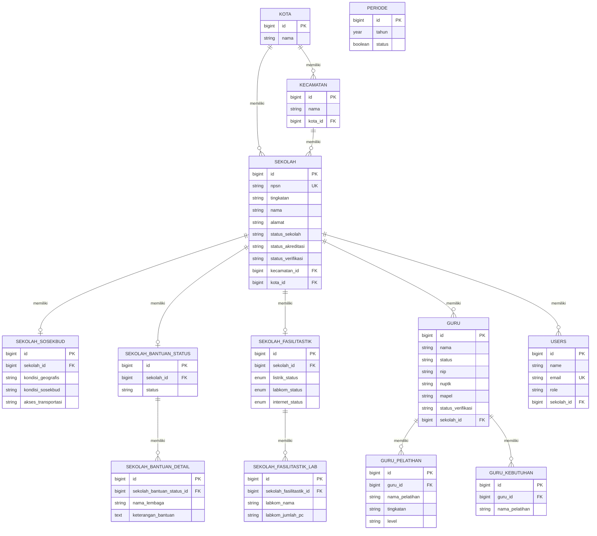

# 📘 DOKUMENTASI PEMBUATAN WEBSITE EMON & EVA PAKE BATIK

> **(e-Monitoring dan e-Evaluasi Berbasis TIK)**
> Balai Teknologi Informasi dan Komunikasi — Dinas Pendidikan Provinsi Maluku

---

## Daftar Isi

1. [Gambaran Umum Sistem](#1-gambaran-umum-sistem)
2. [Tech Stack yang Digunakan](#2-tech-stack-yang-digunakan)
3. [Tahap 1 — Persiapan & Instalasi](#3-tahap-1--persiapan--instalasi)
4. [Tahap 2 — Desain Database & Relasi Data](#4-tahap-2--desain-database--relasi-data)
5. [Tahap 3 — Autentikasi & Role User](#5-tahap-3--autentikasi--role-user)
6. [Tahap 4 — Middleware Role-Based Access](#6-tahap-4--middleware-role-based-access)
7. [Tahap 5 — Pembuatan Model & Relasi Eloquent](#7-tahap-5--pembuatan-model--relasi-eloquent)
8. [Tahap 6 — Pembuatan Controller](#8-tahap-6--pembuatan-controller)
9. [Tahap 7 — Routing (web.php)](#9-tahap-7--routing-webphp)
10. [Tahap 8 — Views & Layout](#10-tahap-8--views--layout)
11. [Tahap 9 — Fitur Import Excel](#11-tahap-9--fitur-import-excel)
12. [Tahap 10 — Seeder & Data Awal](#12-tahap-10--seeder--data-awal)
13. [Tahap 11 — Testing](#13-tahap-11--testing)
14. [Tahap 12 — Deployment Lokal](#14-tahap-12--deployment-lokal)
15. [Diagram Relasi Database (ERD)](#15-diagram-relasi-database-erd)
16. [Struktur Folder Proyek](#16-struktur-folder-proyek)

---

## 1. Gambaran Umum Sistem

EMON & EVA PAKE BATIK adalah sistem informasi berbasis web untuk:
- **Monitoring** data sekolah, guru, dan fasilitas TIK di Provinsi Maluku
- **Evaluasi** kondisi infrastruktur TIK sekolah (listrik, internet, lab komputer)
- **Verifikasi** data yang diinput operator sekolah oleh verifikator
- **Pelaporan** statistik bagi Kepala BTIK (Kabalai)

### 4 Role Pengguna:

| Role | Kode | Fungsi |
|------|------|--------|
| **Administrator** | `1` | Mengelola master data (kota, kecamatan, periode, sekolah, user) |
| **Verifikator** | `2` | Memverifikasi data sekolah & guru yang diajukan operator |
| **Operator Sekolah** | `3` | Menginput data identitas, fasilitas, guru, dan bantuan sekolah |
| **Kepala BTIK (Kabalai)** | `4` | Melihat dashboard statistik & laporan filter data |

---

## 2. Tech Stack yang Digunakan

| Komponen | Teknologi | Versi |
|----------|-----------|-------|
| **Framework** | Laravel | 11.x |
| **PHP** | PHP | ≥ 8.2 |
| **Database** | SQLite | — |
| **Authentication** | Laravel Breeze | 2.x |
| **Frontend Template** | SB Admin (Bootstrap) | — |
| **Build Tool** | Vite | 5.x |
| **CSS Framework** | TailwindCSS + Bootstrap | 3.x / 5.x |
| **JS Framework** | Alpine.js | 3.x |
| **Import Excel** | PhpSpreadsheet | 5.x |
| **Server Lokal** | Laragon | — |

---

## 3. Tahap 1 — Persiapan & Instalasi

### 3.1. Install Laragon
Laragon menyediakan Apache, PHP, dan MySQL/SQLite dalam satu paket.

### 3.2. Buat Proyek Laravel Baru

```bash
# Buka terminal di folder Laragon www
cd C:\laragon\www

# Buat proyek baru
composer create-project laravel/laravel app-emoneva

# Masuk ke folder proyek
cd app-emoneva
```

### 3.3. Install Laravel Breeze (Autentikasi)

```bash
composer require laravel/breeze --dev
php artisan breeze:install blade

# Install frontend dependencies
npm install
npm run build
```

### 3.4. Install PhpSpreadsheet (Import Excel)

```bash
composer require phpoffice/phpspreadsheet
```

### 3.5. Konfigurasi `.env`

```env
APP_NAME=Laravel
APP_URL=http://localhost/app-emoneva/public

DB_CONNECTION=sqlite
# SQLite otomatis menggunakan database/database.sqlite

SESSION_DRIVER=database
```

### 3.6. Generate App Key & Jalankan Migrasi

```bash
php artisan key:generate
php artisan migrate
```

---

## 4. Tahap 2 — Desain Database & Relasi Data

### 4.1. Tabel-Tabel dalam Sistem

Sistem ini memiliki **13 tabel utama** yang dibuat dalam **15 file migrasi**.

#### Urutan Pembuatan Migrasi:

```bash
# 1. Tabel sistem (otomatis dari Laravel)
# cache, jobs, sessions, password_reset_tokens

# 2. Master wilayah
php artisan make:migration create_kota_table
php artisan make:migration create_kecamatan_table
php artisan make:migration create_periode_table

# 3. Data sekolah
php artisan make:migration create_sekolah_table
php artisan make:migration create_sekolah_sosekbud_table
php artisan make:migration create_sekolah_bantuan_status_table
php artisan make:migration create_sekolah_bantuan_detail_table
php artisan make:migration create_sekolah_fasilitastik_table
php artisan make:migration create_sekolah_fasilitastik_lab_table

# 4. Data guru
php artisan make:migration create_guru_table
php artisan make:migration create_guru_pelatihan_table
php artisan make:migration create_guru_kebutuhan_table

# 5. Users (custom, di akhir karena relasi ke sekolah)
php artisan make:migration create_users_table
```

### 4.2. Detail Setiap Tabel

#### 📍 `kota`
Data kabupaten/kota di Maluku.

| Kolom | Tipe | Keterangan |
|-------|------|------------|
| id | bigint (PK) | Auto increment |
| nama | string | Nama kota/kabupaten |

---

#### 📍 `kecamatan`
Data kecamatan, berelasi ke kota.

| Kolom | Tipe | Keterangan |
|-------|------|------------|
| id | bigint (PK) | Auto increment |
| nama | string | Nama kecamatan |
| kota_id | FK → kota | Relasi ke tabel kota |

---

#### 📍 `periode`
Periode tahun pendataan.

| Kolom | Tipe | Keterangan |
|-------|------|------------|
| id | bigint (PK) | Auto increment |
| tahun | year | Tahun periode |
| status | boolean | 0 = tidak aktif, 1 = aktif |

---

#### 🏫 `sekolah`
Tabel utama data sekolah.

| Kolom | Tipe | Keterangan |
|-------|------|------------|
| id | bigint (PK) | Auto increment |
| npsn | string (unique) | Nomor Pokok Sekolah Nasional |
| tingkatan | string | SMA/SMK/SLB |
| nama | string | Nama sekolah |
| alamat | string | Alamat sekolah |
| telepon, email, website | string | Kontak sekolah |
| foto_sekolah | string | Path foto sekolah |
| kepsek_nama, kepsek_hp, kepsek_foto | string | Data kepala sekolah |
| sk_ijin | string | SK ijin operasional |
| status_sekolah | string | 1=Negeri, 2=Swasta/Yayasan |
| status_akreditasi | string | A/B/C/Belum |
| status_tanah | string | Status kepemilikan tanah |
| jum_siswa_pria, jum_siswa_wanita | string | Jumlah siswa |
| jum_guru | string | Jumlah guru |
| status_verifikasi | string | Status verifikasi data |
| keterangan_verifikasi | string | Catatan dari verifikator |
| tahun | string | Tahun pendataan |
| kecamatan_id | FK → kecamatan | Relasi ke kecamatan |
| kota_id | FK → kota | Relasi ke kota |

---

#### 🏫 `sekolah_sosekbud`
Data sosial-ekonomi-budaya sekolah (one-to-one dengan sekolah).

| Kolom | Tipe | Keterangan |
|-------|------|------------|
| id | bigint (PK) | Auto increment |
| sekolah_id | FK → sekolah | Relasi ke sekolah |
| kondisi_geografis | string | Kota/Pedesaan/Terpencil |
| kondisi_sosekbud | string | Kondisi sosial ekonomi |
| akses_transportasi | string | Mudah/Sulit/Sangat Sulit |

---

#### 🏫 `sekolah_bantuan_status`
Status penerimaan bantuan sekolah (one-to-one dengan sekolah).

| Kolom | Tipe | Keterangan |
|-------|------|------------|
| id | bigint (PK) | Auto increment |
| sekolah_id | FK → sekolah | Relasi ke sekolah |
| status | string | Status pernah menerima bantuan |

---

#### 🏫 `sekolah_bantuan_detail`
Detail bantuan yang pernah diterima (many per sekolah_bantuan_status).

| Kolom | Tipe | Keterangan |
|-------|------|------------|
| id | bigint (PK) | Auto increment |
| sekolah_bantuan_status_id | FK → sekolah_bantuan_status | Relasi ke status bantuan |
| nama_lembaga | string | Nama lembaga pemberi bantuan |
| keterangan_bantuan | text | Deskripsi bantuan |

---

#### 🏫 `sekolah_fasilitastik`
Fasilitas TIK sekolah (one-to-one dengan sekolah).

| Kolom | Tipe | Keterangan |
|-------|------|------------|
| id | bigint (PK) | Auto increment |
| sekolah_id | FK → sekolah | Relasi ke sekolah |
| listrik_status | enum (ada/tidak) | Status listrik |
| listrik_sumber | string | Sumber listrik (PLN/Genset/dll) |
| listrik_durasi | string | Durasi ketersediaan |
| jumlah_kom | string | Jumlah komputer |
| labkom_status | enum (ada/tidak) | Status lab komputer |
| internet_status | enum (ada/tidak) | Status internet |
| internet_sumber | string | Sumber internet |
| internet_bandwith | string | Bandwidth internet |
| topologi_jaringan | string | Topologi jaringan |
| internet_kesesuaian | string | Kesesuaian kuota |
| internet_alasankuota | text | Alasan kuota |
| saran_pengembangan | text | Saran pengembangan TIK |

---

#### 🏫 `sekolah_fasilitastik_lab`
Data lab komputer per sekolah (many per fasilitas TIK).

| Kolom | Tipe | Keterangan |
|-------|------|------------|
| id | bigint (PK) | Auto increment |
| sekolah_fasilitastik_id | FK → sekolah_fasilitastik | Relasi ke fasilitas TIK |
| labkom_nama | string | Nama lab |
| labkom_jumlah_pc | string | Jumlah PC di lab |

---

#### 👨‍🏫 `guru`
Data guru, berelasi ke sekolah.

| Kolom | Tipe | Keterangan |
|-------|------|------------|
| id | bigint (PK) | Auto increment |
| nama | string | Nama guru |
| status | string | 1=PNS, 2=PPPK |
| nip, nuptk | string | Nomor identitas |
| tempat, tgl_lahir | string, date | Tempat tanggal lahir |
| agama, jenis_kelamin | string | Data pribadi |
| pendidikan_terakhir | string | S1/S2/dll |
| tmt_pns_tahun | date | TMT PNS |
| telepon | string | Nomor telepon |
| mapel | string | Mata pelajaran yang diampu |
| sertifikasi_status/tahun/alasan | string | Data sertifikasi |
| kompetensi_word/powerpoin/excel | string | Kompetensi TIK dasar |
| kompetensi_pemrogramman/jaringan/multimedia | string | Kompetensi TIK lanjut |
| pelatihan_status | string | Pernah ikut pelatihan? (Ya/Tidak) |
| pelatihan_kebutuhan | string | Butuh pelatihan? (Ya/Tidak) |
| status_verifikasi | string | Status verifikasi guru |
| catatan_verifikasi | string | Catatan dari verifikator |
| tahun | string | Tahun pendataan |
| sekolah_id | FK → sekolah | Relasi ke sekolah |

---

#### 👨‍🏫 `guru_pelatihan`
Riwayat pelatihan guru (many per guru).

| Kolom | Tipe | Keterangan |
|-------|------|------------|
| id | bigint (PK) | Auto increment |
| guru_id | FK → guru | Relasi ke guru |
| nama_pelatihan | string | Nama pelatihan |
| tingkatan | string | 1=Pemula, 2=Lanjutan, 3=Mahir |
| level | string | 1=Lokal, 2=Nasional, 3=Internasional |
| tahun_pelatihan | string | Tahun pelatihan |
| jam_pelatihan | string | Jumlah jam pelatihan |

---

#### 👨‍🏫 `guru_kebutuhan`
Kebutuhan pelatihan guru (many per guru).

| Kolom | Tipe | Keterangan |
|-------|------|------------|
| id | bigint (PK) | Auto increment |
| guru_id | FK → guru | Relasi ke guru |
| nama_pelatihan | string | Nama pelatihan yang dibutuhkan |

---

#### 👤 `users`
Data pengguna sistem.

| Kolom | Tipe | Keterangan |
|-------|------|------------|
| id | bigint (PK) | Auto increment |
| name | string | Nama lengkap |
| email | string (unique) | Email / NPSN (untuk operator) |
| phone | string | Nomor telepon |
| role | string | 1=Admin, 2=Verifikator, 3=Operator, 4=Kabalai |
| password | string | Password (auto-hashed via model cast) |
| sekolah_id | FK → sekolah (nullable) | Relasi ke sekolah (khusus operator) |
| email_verified_at | timestamp | Waktu verifikasi email |

---

## 5. Tahap 3 — Autentikasi & Role User

### 5.1. Laravel Breeze menyediakan:
- Halaman Login (`resources/views/auth/login.blade.php`)
- Halaman Register (`resources/views/auth/register.blade.php`)
- Controller autentikasi (`app/Http/Controllers/Auth/`)
- LoginRequest dengan rate limiting (`app/Http/Requests/Auth/LoginRequest.php`)

### 5.2. Kustomisasi Login
Form login dikustomisasi dari default Breeze menggunakan template **SB Admin**:
- Label input diubah menjadi "NPSN / Email"
- Operator sekolah login menggunakan NPSN, bukan email
- Input type diubah dari `email` ke `text` untuk mendukung NPSN

### 5.3. Kolom `role` di tabel `users`

```
1 = Administrator
2 = Verifikator
3 = Operator Sekolah
4 = Kepala BTIK (Kabalai)
```

---

## 6. Tahap 4 — Middleware Role-Based Access

### 6.1. Buat 4 Middleware

```bash
php artisan make:middleware Administrator
php artisan make:middleware Operator
php artisan make:middleware Verifikator
php artisan make:middleware Kabalai
```

### 6.2. Logika Middleware

Setiap middleware mengecek `Auth::user()->role` dan mengarahkan user ke dashboard sesuai role-nya. Contoh middleware `Administrator`:

```php
public function handle(Request $request, Closure $next): Response
{
    if (!Auth::check()) {
        return redirect()->route('login');
    }

    $userRole = Auth::user()->role;

    if ($userRole == 1) {               // Administrator
        return $next($request);
    }
    if ($userRole == 2) {               // Verifikator
        return redirect()->route('verifikator.dashboard');
    }
    if ($userRole == 3) {               // Operator
        return redirect()->route('operator.dashboard');
    }
    if ($userRole == 4) {               // Kabalai
        return redirect()->route('kabalai.dashboard');
    }
}
```

### 6.3. Daftarkan Middleware di `bootstrap/app.php`

```php
->withMiddleware(function (Middleware $middleware) {
     $middleware->alias([
         'Administrator' => Administrator::class,
         'Operator'      => Operator::class,
         'Verifikator'   => Verifikator::class,
         'Kabalai'       => Kabalai::class,
     ]);
})
```

---

## 7. Tahap 5 — Pembuatan Model & Relasi Eloquent

### 7.1. Buat Semua Model

```bash
php artisan make:model Kota
php artisan make:model Kecamatan
php artisan make:model Periode
php artisan make:model Sekolah
php artisan make:model SekolahSosekbud
php artisan make:model SekolahBantuanStatus
php artisan make:model SekolahBantuanDetail
php artisan make:model SekolahFasilitas
php artisan make:model SekolahFasilitasLab
php artisan make:model Guru
php artisan make:model GuruPelatihan
php artisan make:model GuruKebutuhan
# User sudah ada dari Breeze
```

### 7.2. Relasi Antar Model

```
┌─────────┐          ┌──────────────┐
│  Kota   │ 1 ──── N │  Kecamatan   │
└─────────┘          └──────────────┘
     │                      │
     │ 1                    │ 1
     │ ║                    │ ║
     │ N                    │ N
┌────┴────────────────────┴─────┐
│           Sekolah              │
├────────────────────────────────┤
│ - npsn, nama, alamat, dll      │
│ - status_verifikasi            │
└──┬───┬───┬───┬───┬─────────────┘
   │   │   │   │   │
   │   │   │   │   └──── 1:N ──→ User (operator)
   │   │   │   │
   │   │   │   └──────── 1:1 ──→ SekolahSosekbud
   │   │   │
   │   │   └──────────── 1:1 ──→ SekolahBantuanStatus ──→ 1:N SekolahBantuanDetail
   │   │
   │   └──────────────── 1:1 ──→ SekolahFasilitas ──→ 1:N SekolahFasilitasLab
   │
   └──────────────────── 1:N ──→ Guru
                                  │
                                  ├── 1:N ──→ GuruPelatihan
                                  └── 1:N ──→ GuruKebutuhan
```

### 7.3. Contoh Relasi di Model `Sekolah`

```php
class Sekolah extends Model
{
    // Sekolah milik satu kota
    public function kota()          { return $this->belongsTo(Kota::class); }

    // Sekolah milik satu kecamatan
    public function kecamatan()     { return $this->belongsTo(Kecamatan::class); }

    // Sekolah punya banyak user (operator)
    public function users()         { return $this->hasMany(User::class); }

    // Sekolah punya satu data sosekbud
    public function sekolah_sosekbud()  { return $this->hasOne(SekolahSosekbud::class); }

    // Sekolah punya satu status bantuan
    public function bantuanStatus()     { return $this->hasOne(SekolahBantuanStatus::class); }

    // Sekolah punya banyak detail bantuan
    public function bantuanDetails()    { return $this->hasMany(SekolahBantuanDetail::class); }

    // Sekolah punya satu data fasilitas TIK
    public function fasilitas()         { return $this->hasOne(SekolahFasilitas::class); }

    // Sekolah punya banyak guru
    public function guru()              { return $this->hasMany(Guru::class); }
}
```

### 7.4. Contoh Relasi di Model `Guru`

```php
class Guru extends Model
{
    // Guru milik satu sekolah
    public function sekolah()           { return $this->belongsTo(Sekolah::class); }

    // Guru punya banyak riwayat pelatihan
    public function pelatihan()         { return $this->hasMany(GuruPelatihan::class); }

    // Guru punya banyak kebutuhan pelatihan
    public function kebutuhanPelatihan(){ return $this->hasMany(GuruKebutuhan::class); }
}
```

---

## 8. Tahap 6 — Pembuatan Controller

### 8.1. Daftar Seluruh Controller (29 file)

```bash
# Controller Administrator
php artisan make:controller AdministratorController      # Dashboard admin
php artisan make:controller KotaController               # CRUD kota
php artisan make:controller KecamatanController          # CRUD kecamatan
php artisan make:controller PeriodeController             # CRUD periode
php artisan make:controller SekolahController             # CRUD sekolah + import
php artisan make:controller UserController                # CRUD operator sekolah
php artisan make:controller ManajemenUserController       # CRUD manajemen user

# Controller Operator Sekolah
php artisan make:controller OperatorController            # Dashboard operator
php artisan make:controller DataSekolahController         # Input identitas & sosekbud
php artisan make:controller BantuanSekolahController      # Input bantuan sekolah
php artisan make:controller FasilitasSekolahController    # Input fasilitas TIK
php artisan make:controller GuruController --resource     # CRUD data guru

# Controller Verifikator
php artisan make:controller UserVerifikatorController     # Dashboard verifikator
php artisan make:controller VerifikasiProsesController    # Verifikasi data sekolah
php artisan make:controller VerifikasiGuruController      # Verifikasi data guru
php artisan make:controller MonitoringGuruController      # Monitoring guru

# Controller Kabalai (Filter & Statistik)
php artisan make:controller USerKabalaiController         # Dashboard kabalai
php artisan make:controller FilterAkreditasiController    # Filter akreditasi
php artisan make:controller FilterStatusBantuanController # Filter status bantuan
php artisan make:controller FilterKuotaInternetController # Filter internet
php artisan make:controller FilterListrikController       # Filter listrik
php artisan make:controller FilterLabkomputerController   # Filter lab komputer
php artisan make:controller FilterGuruStatusController    # Filter status guru
php artisan make:controller FilterGuruPendidikanController # Filter pendidikan guru
php artisan make:controller FilterSertifikasiStatusController # Filter sertifikasi
php artisan make:controller FilterGuruKebutuhanPelatihanController # Filter kebutuhan
php artisan make:controller DataStatistikGuruController   # Statistik guru
```

### 8.2. Alur Kerja Utama

```
Operator Sekolah                 Verifikator                 Kabalai
─────────────────               ─────────────               ──────────
1. Login (NPSN)                 1. Login (email)            1. Login (email)
2. Input identitas sekolah      2. Lihat daftar sekolah     2. Lihat dashboard
3. Input data sosekbud          3. Verifikasi/tolak data    3. Filter data per kota
4. Input data bantuan           4. Lihat daftar guru        4. Lihat statistik chart
5. Input fasilitas TIK          5. Verifikasi/tolak guru    5. Export/cetak laporan
6. Input data guru
7. Ajukan verifikasi
```

---

## 9. Tahap 7 — Routing (web.php)

### 9.1. Struktur Route Berdasarkan Role

```php
// Halaman publik
Route::get('/', function () { return view('welcome'); });

// Profile (semua user yang login)
Route::middleware('auth')->group(function () {
    Route::get('/profile', ...);
    Route::patch('/profile', ...);
    Route::delete('/profile', ...);
});

// ROLE ADMINISTRATOR (role = 1)
Route::middleware('auth', 'verified', 'Administrator')->group(function () {
    Route::get('/dashboard', ...);          // Dashboard admin
    // CRUD: kecamatan, kota, periode, sekolah
    // CRUD: operator-sekolah, user-manajemen
    Route::post('/sekolah/import', ...);    // Import dari Excel
});

// ROLE OPERATOR SEKOLAH (role = 3)
Route::middleware('auth', 'verified', 'Operator')->group(function () {
    Route::get('/dashboard-operator', ...);
    // Input: identitas, sosekbud, bantuan, fasilitas
    Route::resource('data-guru', GuruController::class);
    Route::post('/sekolah/ajukan-verifikasi', ...);
});

// ROLE VERIFIKATOR (role = 2)
Route::middleware('auth', 'verified', 'Verifikator')->group(function () {
    Route::get('/dashboard-verifikator', ...);
    Route::resource('verifikasi-sekolah', ...);
    Route::resource('verifikasi-guru', ...);
    Route::resource('monitoring-guru', ...);
});

// ROLE KABALAI (role = 4)
Route::middleware('auth', 'verified', 'Kabalai')->group(function () {
    Route::get('kabalai-dashboard', ...);
    // Filter: akreditasi, bantuan, internet, listrik, lab komputer
    // Filter guru: status, pendidikan, sertifikasi, kebutuhan pelatihan
});
```

---

## 10. Tahap 8 — Views & Layout

### 10.1. Struktur Folder Views

```
resources/views/
├── auth/                          # Halaman login & register
│   ├── login.blade.php            # Login kustom (SB Admin template)
│   └── login_old.blade.php        # Backup login Breeze default
├── layouts/                       # Layout utama
│   ├── app.blade.php              # Layout utama aplikasi
│   ├── guest.blade.php            # Layout halaman tamu
│   ├── navbar.blade.php           # Navbar atas
│   ├── navigation.blade.php       # Navigasi Breeze
│   └── partial/                   # Komponen partial (sidebar dll)
├── components/                    # Blade components
├── administrator/                 # View khusus admin
│   └── dashboard.blade.php
├── operator/                      # View khusus operator
│   └── dashboard.blade.php
├── verifikator/                   # View khusus verifikator
│   ├── dashboard.blade.php
│   ├── verifikasi-sekolah.blade.php
│   ├── verifikasi-sekolah-detail.blade.php
│   ├── verifikasi-guru.blade.php
│   └── verifikasi-guru-detail.blade.php
├── kabalai/                       # View khusus kabalai
│   ├── dashboard.blade.php
│   ├── sort-sekolah/              # Halaman filter sekolah
│   └── sort-guru/                 # Halaman filter guru
├── pages/                         # Halaman CRUD admin
│   ├── kecamatan/
│   ├── kota/
│   ├── periode/
│   ├── sekolah/
│   ├── operator-sekolah/
│   ├── manajemen-user/
│   ├── monitoring-sekolah/
│   └── monitoring-guru/
├── profile/                       # Halaman profil user
├── dashboard.blade.php            # Redirect dashboard
├── welcome.blade.php              # Landing page
└── sample-page.blade.php          # Halaman contoh
```

### 10.2. Template SB Admin
Halaman login dan dashboard menggunakan template **SB Admin** (Bootstrap-based). Asset SB Admin disimpan di:
```
public/sbadmin/
├── css/styles.css
├── js/scripts.js
└── assets/img/
    ├── favicon.png
    ├── logo_pemprov.png
    └── logo_wa.png
```

---

## 11. Tahap 9 — Fitur Import Excel

Sistem mendukung import data sekolah dari file Excel menggunakan **PhpSpreadsheet**.

```php
// routes/web.php
Route::post('/sekolah/import', [SekolahController::class, 'import'])->name('sekolah.import');
```

Fitur ini tersedia di panel Administrator untuk mengunggah data sekolah secara massal.

---

## 12. Tahap 10 — Seeder & Data Awal

### 12.1. Database Seeder

```php
// database/seeders/DatabaseSeeder.php

User::factory()->createMany([
    [
        'name'     => 'Ibu Kabalai',
        'email'    => 'kabalai@gmail.com',
        'phone'    => '081187651238',
        'role'     => '4',            // Kabalai
        'password' => '12345678',     // Auto-hash via model cast
    ],
    [
        'name'     => 'Verifikator Echa',
        'email'    => 'verif@gmail.com',
        'phone'    => '081187651237',
        'role'     => '2',            // Verifikator
        'password' => '12345678',
    ],
    [
        'name'     => 'Operator SMA',
        'email'    => 'operator@gmail.com',
        'phone'    => '081187651235',
        'role'     => '2',            // Operator
        'password' => '12345678',
    ],
    [
        'name'     => 'Administrator Echa',
        'email'    => 'admin@gmail.com',
        'phone'    => '081187651234',
        'role'     => '1',            // Administrator
        'password' => '12345678',
    ],
]);
```

### 12.2. Jalankan Seeder

```bash
php artisan db:seed
```

> ⚠️ **Penting**: Model `User` memiliki cast `'password' => 'hashed'`, sehingga password TIDAK perlu di-`bcrypt()` di seeder (sudah otomatis di-hash oleh Eloquent).

---

## 13. Tahap 11 — Testing

### 13.1. Test Bawaan Laravel Breeze

```
tests/Feature/Auth/
├── AuthenticationTest.php          # Test login/logout
├── EmailVerificationTest.php       # Test verifikasi email
├── PasswordConfirmationTest.php    # Test konfirmasi password
├── PasswordResetTest.php           # Test reset password
├── PasswordUpdateTest.php          # Test update password
└── RegistrationTest.php            # Test registrasi
```

### 13.2. Jalankan Test

```bash
# Pastikan build Vite sudah ada
npm run build

# Jalankan semua test
php artisan test
```

> ⚠️ **Penting**: `php artisan test` menggunakan `RefreshDatabase` yang menghapus semua data. Jalankan `php artisan db:seed` ulang setelah testing.

---

## 14. Tahap 12 — Deployment Lokal

### 14.1. Menggunakan Laragon

1. Taruh folder proyek di `C:\laragon\www\app-emoneva`
2. Start Laragon (Apache + PHP)
3. Akses via `http://localhost/app-emoneva/public`

### 14.2. Menggunakan `php artisan serve`

```bash
php artisan serve
# Akses via http://127.0.0.1:8000
```

### 14.3. Build Asset Frontend

```bash
# Install dependencies (sekali saja)
npm install

# Build untuk production
npm run build

# Atau jalankan dev server (hot reload)
npm run dev
```

---

## 15. Diagram Relasi Database (ERD)



---

## 16. Struktur Folder Proyek

```
app-emoneva/
├── app/
│   ├── Http/
│   │   ├── Controllers/
│   │   │   ├── Auth/                       # Controller autentikasi (Breeze)
│   │   │   ├── AdministratorController.php # Dashboard admin
│   │   │   ├── SekolahController.php       # CRUD + import sekolah
│   │   │   ├── GuruController.php          # CRUD guru (resource)
│   │   │   ├── VerifikasiProsesController.php # Verifikasi sekolah
│   │   │   ├── VerifikasiGuruController.php   # Verifikasi guru
│   │   │   ├── Filter*Controller.php       # Controller filter kabalai
│   │   │   └── ... (29 controller total)
│   │   ├── Middleware/
│   │   │   ├── Administrator.php           # Middleware role admin
│   │   │   ├── Operator.php                # Middleware role operator
│   │   │   ├── Verifikator.php             # Middleware role verifikator
│   │   │   └── Kabalai.php                 # Middleware role kabalai
│   │   └── Requests/Auth/
│   │       └── LoginRequest.php            # Validasi & rate limiting login
│   └── Models/
│       ├── User.php                        # Model user (13 model total)
│       ├── Sekolah.php
│       ├── Guru.php
│       └── ...
├── bootstrap/
│   └── app.php                             # Registrasi middleware alias
├── config/
│   ├── auth.php
│   └── session.php
├── database/
│   ├── database.sqlite                     # Database SQLite
│   ├── migrations/                         # 15 file migrasi
│   └── seeders/
│       └── DatabaseSeeder.php              # Seed 4 user awal
├── public/
│   ├── sbadmin/                            # Template SB Admin (CSS/JS/img)
│   └── build/                              # Output Vite build
├── resources/
│   └── views/                              # Semua Blade views
│       ├── auth/                           # Login & register
│       ├── layouts/                        # Layout utama
│       ├── administrator/                  # Dashboard admin
│       ├── operator/                       # Dashboard operator
│       ├── verifikator/                    # Dashboard & verifikasi
│       ├── kabalai/                        # Dashboard & filter
│       └── pages/                          # Halaman CRUD (8 folder)
├── routes/
│   ├── web.php                             # Semua route (175 baris)
│   └── auth.php                            # Route autentikasi (Breeze)
├── tests/Feature/Auth/                     # 6 test autentikasi
├── .env                                    # Konfigurasi environment
├── composer.json                           # Dependencies PHP
└── package.json                            # Dependencies Node.js
```

---

## Ringkasan Langkah Pembuatan

| No | Tahap | Perintah / Aksi Utama |
|----|-------|----------------------|
| 1 | Buat proyek Laravel | `composer create-project laravel/laravel app-emoneva` |
| 2 | Install Breeze | `composer require laravel/breeze --dev` → `php artisan breeze:install blade` |
| 3 | Install PhpSpreadsheet | `composer require phpoffice/phpspreadsheet` |
| 4 | Konfigurasi `.env` | Set `DB_CONNECTION=sqlite`, `APP_URL`, `SESSION_DRIVER=database` |
| 5 | Buat migrasi database | 15 file migrasi untuk 13 tabel |
| 6 | Jalankan migrasi | `php artisan migrate` |
| 7 | Buat model Eloquent | 13 model dengan relasi `hasMany`, `belongsTo`, `hasOne` |
| 8 | Buat middleware role | 4 middleware di `app/Http/Middleware/` |
| 9 | Daftarkan middleware | Di `bootstrap/app.php` via `$middleware->alias()` |
| 10 | Buat controller | 29 controller untuk semua fitur |
| 11 | Definisikan routes | 4 grup route berdasarkan role di `web.php` |
| 12 | Buat views Blade | Login kustom + dashboard + CRUD + verifikasi + filter |
| 13 | Buat seeder | Seed 4 user awal di `DatabaseSeeder.php` |
| 14 | Build frontend | `npm install` → `npm run build` |
| 15 | Jalankan seeder | `php artisan db:seed` |
| 16 | Test | `php artisan test` |

---

*Dokumentasi ini dibuat secara otomatis berdasarkan analisis kode sumber proyek EMON & EVA PAKE BATIK.*
