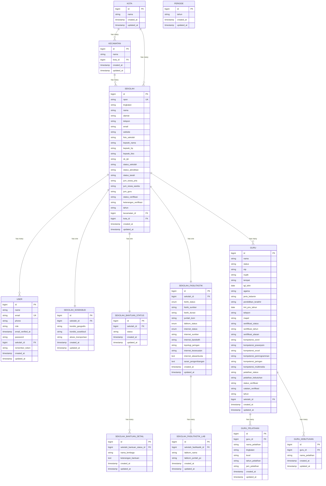
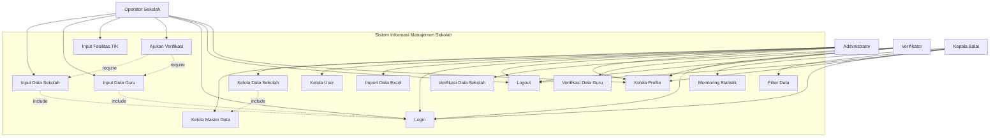
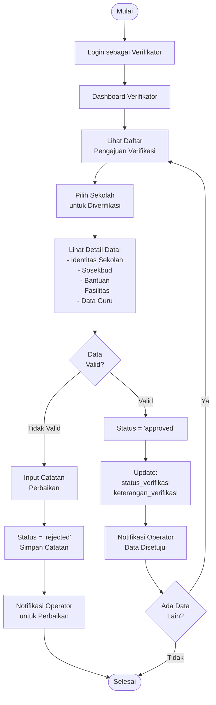
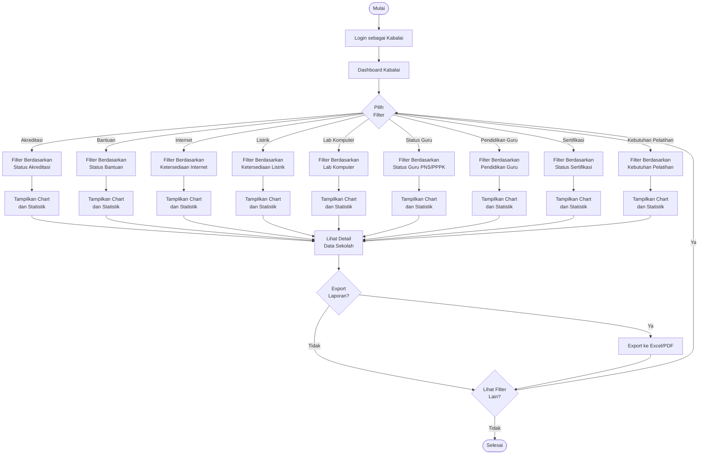
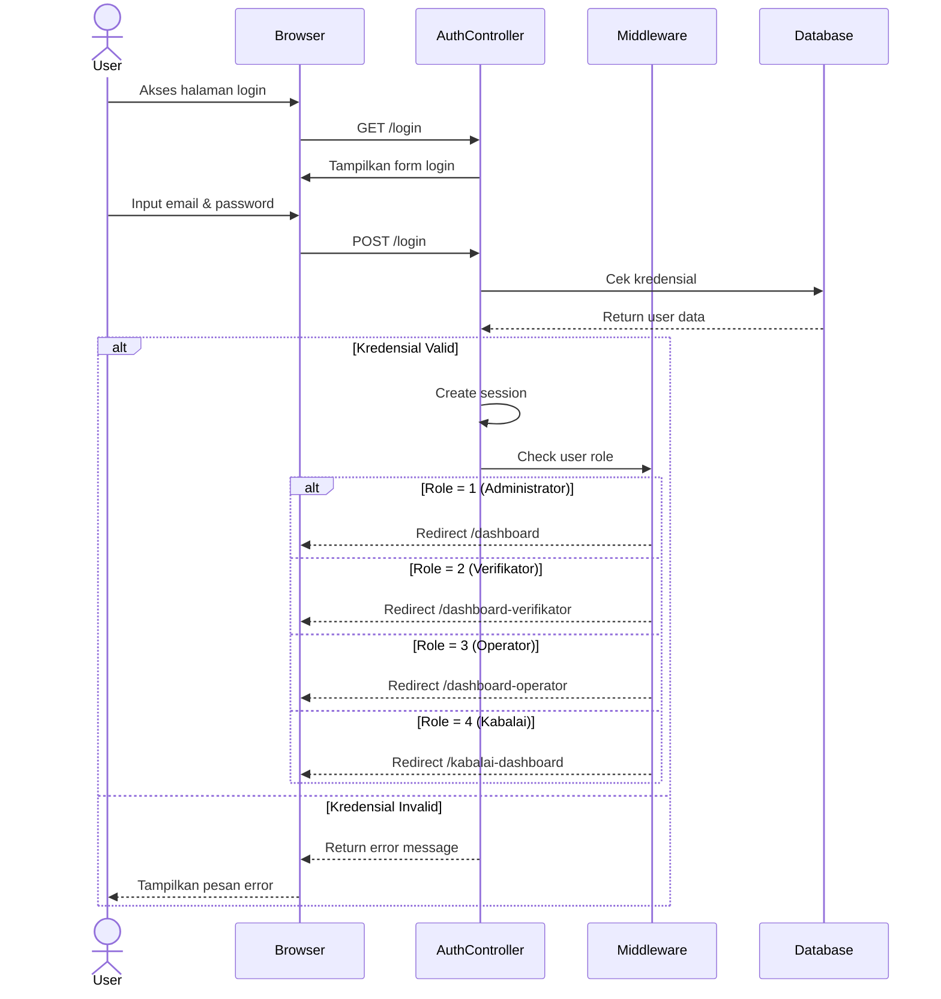
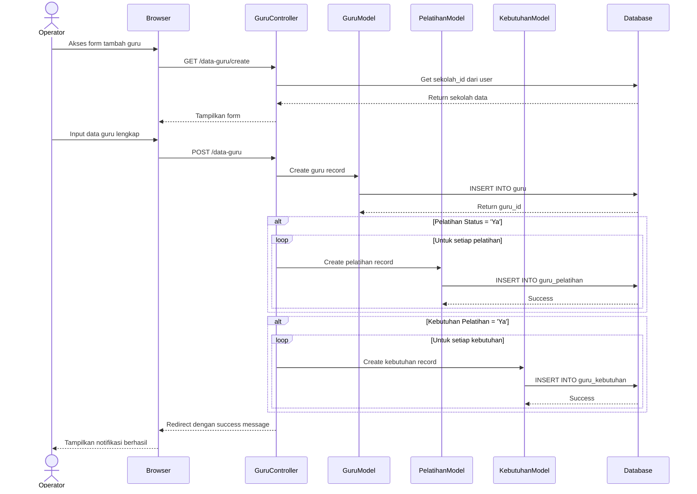
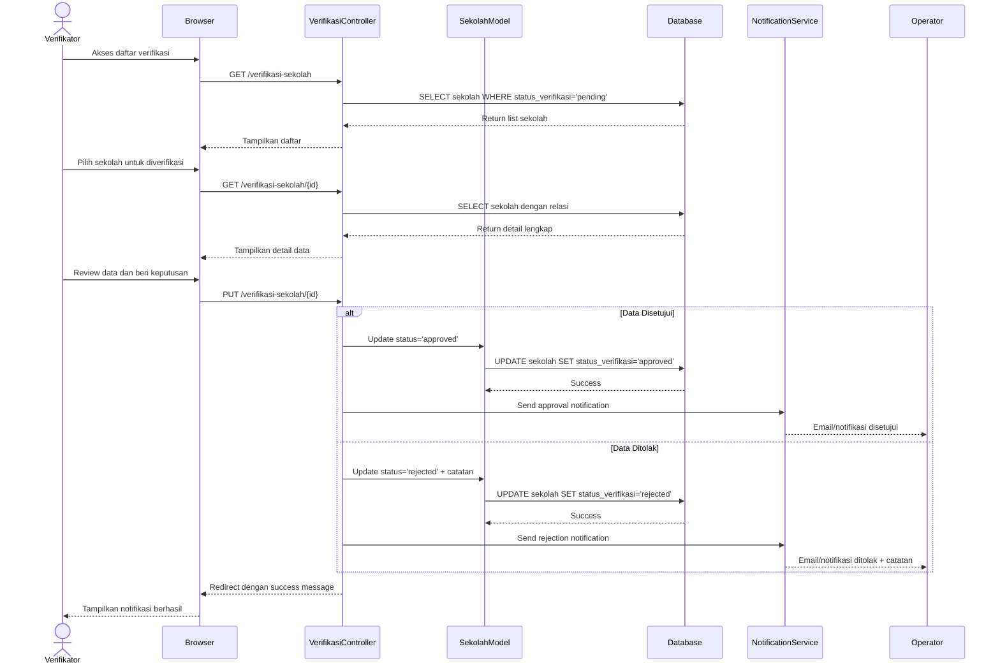
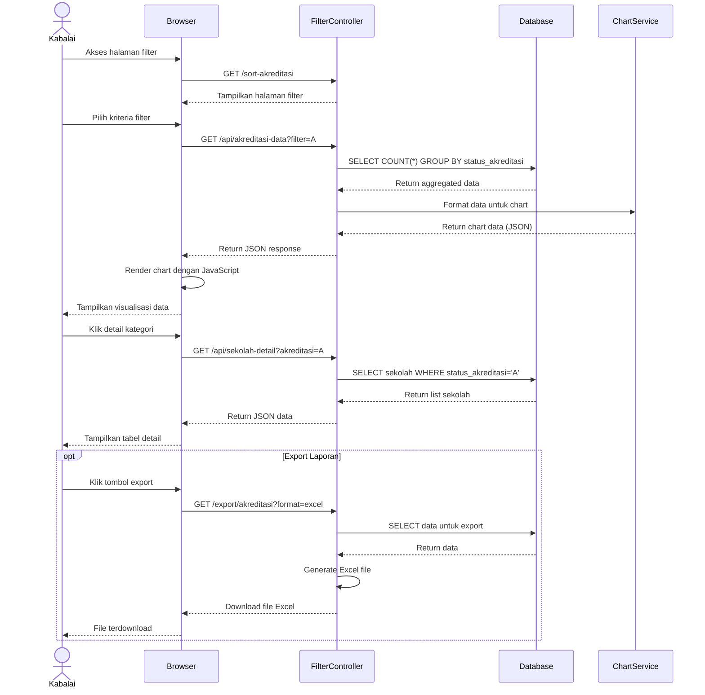

# DOKUMENTASI SISTEM INFORMASI MANAJEMEN DATA SEKOLAH DAN GURU

## 1. OVERVIEW SISTEM

### 1.1 Deskripsi Sistem
Sistem Informasi Manajemen Data Sekolah dan Guru adalah aplikasi berbasis web yang dibangun untuk mengelola data sekolah, guru, fasilitas TIK, dan proses verifikasi data di lingkungan pendidikan. Sistem ini memfasilitasi pengumpulan, pengelolaan, dan monitoring data pendidikan secara terpusat.

### 1.2 Framework dan Teknologi
- **Framework**: Laravel 11.x (PHP 8.2+)
- **Authentication**: Laravel Breeze
- **Database**: SQLite (dapat diganti dengan MySQL/PostgreSQL)
- **Frontend**: Blade Template Engine
- **Library Tambahan**: 
  - PhpSpreadsheet (untuk import/export Excel)
  - Laravel Tinker (untuk debugging)

### 1.3 Arsitektur Sistem
Sistem menggunakan arsitektur MVC (Model-View-Controller) dengan pattern:
- **Model**: Eloquent ORM untuk interaksi database
- **View**: Blade templates untuk presentasi
- **Controller**: Logic handler untuk business process
- **Middleware**: Role-based access control (RBAC)

---

## 2. STRUKTUR DATABASE

### 2.1 Entity Relationship Diagram (ERD)



### 2.2 Deskripsi Tabel


#### Tabel Master
1. **kota**: Menyimpan data kota/kabupaten
2. **kecamatan**: Menyimpan data kecamatan dengan relasi ke kota
3. **periode**: Menyimpan data periode/tahun ajaran

#### Tabel Sekolah
4. **sekolah**: Data utama sekolah (NPSN, nama, alamat, kepala sekolah, dll)
5. **sekolah_sosekbud**: Data kondisi sosial ekonomi budaya sekolah
6. **sekolah_bantuan_status**: Status penerimaan bantuan sekolah
7. **sekolah_bantuan_detail**: Detail bantuan yang diterima sekolah
8. **sekolah_fasilitastik**: Data fasilitas TIK (listrik, komputer, internet)
9. **sekolah_fasilitastik_lab**: Detail laboratorium komputer di sekolah

#### Tabel Guru
10. **guru**: Data utama guru (identitas, kompetensi, sertifikasi)
11. **guru_pelatihan**: Riwayat pelatihan yang pernah diikuti guru
12. **guru_kebutuhan**: Kebutuhan pelatihan guru

#### Tabel User
13. **users**: Data pengguna sistem dengan role-based access
14. **password_reset_tokens**: Token untuk reset password
15. **sessions**: Manajemen session pengguna

---

## 3. ALUR KERJA SISTEM

### 3.1 Role dan Hak Akses

Sistem memiliki 4 role utama:

| Role | Kode | Deskripsi | Hak Akses |
|------|------|-----------|-----------|
| Administrator | 1 | Pengelola sistem | CRUD master data, user management |
| Verifikator | 2 | Verifikator data | Verifikasi data sekolah dan guru |
| Operator Sekolah | 3 | Input data sekolah | Input/edit data sekolah dan guru |
| Kepala Balai (Kabalai) | 4 | Monitoring | View statistik dan laporan |


### 3.2 Alur Proses Utama

#### A. Proses Registrasi Sekolah
1. Administrator menambah data sekolah (manual/import Excel)
2. Sistem otomatis membuat:
   - Record di tabel `sekolah`
   - Record di tabel `sekolah_sosekbud`
   - User operator dengan email=NPSN, password=NPSN, role=3

#### B. Proses Input Data oleh Operator Sekolah
1. Login menggunakan NPSN sebagai email
2. Melengkapi data identitas sekolah
3. Input data sosial ekonomi budaya
4. Input data bantuan yang diterima
5. Input data fasilitas TIK dan laboratorium
6. Input data guru beserta kompetensi dan pelatihan
7. Mengajukan verifikasi data

#### C. Proses Verifikasi
1. Verifikator melihat daftar sekolah yang mengajukan verifikasi
2. Memeriksa kelengkapan dan kebenaran data
3. Memberikan status:
   - Disetujui (status_verifikasi = approved)
   - Ditolak dengan catatan perbaikan
4. Operator memperbaiki data jika ditolak

#### D. Proses Monitoring (Kabalai)
1. Melihat dashboard statistik
2. Filter data berdasarkan:
   - Status akreditasi
   - Status bantuan
   - Ketersediaan internet
   - Ketersediaan listrik
   - Status laboratorium komputer
   - Status guru (PNS/PPPK)
   - Pendidikan guru
   - Status sertifikasi guru
   - Kebutuhan pelatihan guru
3. Export laporan

---

## 4. USE CASE DIAGRAM



### 4.1 Deskripsi Use Case


| Use Case | Actor | Deskripsi |
|----------|-------|-----------|
| UC1 - Kelola Master Data | Administrator | Mengelola data kota, kecamatan, dan periode |
| UC2 - Kelola Data Sekolah | Administrator | CRUD data sekolah |
| UC3 - Kelola User | Administrator | Mengelola user verifikator dan kabalai |
| UC4 - Input Data Sekolah | Operator | Input identitas, sosekbud, bantuan sekolah |
| UC5 - Input Data Guru | Operator | Input data guru, kompetensi, pelatihan |
| UC6 - Input Fasilitas TIK | Operator | Input data listrik, komputer, internet, lab |
| UC7 - Ajukan Verifikasi | Operator | Mengajukan data untuk diverifikasi |
| UC8 - Verifikasi Data Sekolah | Verifikator | Memeriksa dan approve/reject data sekolah |
| UC9 - Verifikasi Data Guru | Verifikator | Memeriksa dan approve/reject data guru |
| UC10 - Monitoring Statistik | Kabalai | Melihat dashboard dan statistik |
| UC11 - Filter Data | Kabalai | Filter data berdasarkan berbagai kriteria |
| UC12 - Login | Semua | Autentikasi pengguna |
| UC13 - Logout | Semua | Keluar dari sistem |
| UC14 - Kelola Profile | Semua | Update profile dan password |
| UC15 - Import Data Excel | Administrator | Import bulk data sekolah dari Excel |

---

## 5. ACTIVITY DIAGRAM

### 5.1 Activity Diagram - Proses Input Data Sekolah

```mermaid
flowchart TD
    Start([Mulai]) --> Login[Login sebagai Operator]
    Login --> CheckAuth{Autentikasi<br/>Berhasil?}
    CheckAuth -->|Tidak| Login
    CheckAuth -->|Ya| Dashboard[Dashboard Operator]
    
    Dashboard --> MenuIdentitas[Pilih Menu<br/>Identitas Sekolah]
    MenuIdentitas --> InputIdentitas[Input/Update:<br/>- NPSN<br/>- Nama Sekolah<br/>- Alamat<br/>- Kepala Sekolah<br/>- Status Akreditasi]
    InputIdentitas --> SaveIdentitas[Simpan Data Identitas]
    
    SaveIdentitas --> MenuSosekbud[Pilih Menu<br/>Sosial Ekonomi Budaya]
    MenuSosekbud --> InputSosekbud[Input:<br/>- Kondisi Geografis<br/>- Kondisi Sosekbud<br/>- Akses Transportasi]
    InputSosekbud --> SaveSosekbud[Simpan Data Sosekbud]
    
    SaveSosekbud --> MenuBantuan[Pilih Menu<br/>Bantuan Sekolah]
    MenuBantuan --> InputBantuan[Input:<br/>- Status Bantuan<br/>- Nama Lembaga<br/>- Keterangan Bantuan]
    InputBantuan --> SaveBantuan[Simpan Data Bantuan]
    
    SaveBantuan --> MenuFasilitas[Pilih Menu<br/>Fasilitas TIK]
    MenuFasilitas --> InputFasilitas[Input:<br/>- Status Listrik<br/>- Jumlah Komputer<br/>- Status Internet<br/>- Lab Komputer]
    InputFasilitas --> SaveFasilitas[Simpan Data Fasilitas]
    
    SaveFasilitas --> MenuGuru[Pilih Menu<br/>Data Guru]
    MenuGuru --> InputGuru[Input Data Guru:<br/>- Identitas<br/>- Kompetensi<br/>- Pelatihan<br/>- Kebutuhan]
    InputGuru --> SaveGuru[Simpan Data Guru]
    
    SaveGuru --> CheckComplete{Data<br/>Lengkap?}
    CheckComplete -->|Tidak| Dashboard
    CheckComplete -->|Ya| AjukanVerifikasi[Ajukan Verifikasi]
    
    AjukanVerifikasi --> UpdateStatus[Update Status:<br/>status_verifikasi = 'pending']
    UpdateStatus --> NotifVerifikator[Notifikasi ke<br/>Verifikator]
    NotifVerifikator --> End([Selesai])
```



### 5.2 Activity Diagram - Proses Verifikasi Data



### 5.3 Activity Diagram - Proses Monitoring (Kabalai)



---

## 6. SEQUENCE DIAGRAM

### 6.1 Sequence Diagram - Login dan Autentikasi



### 6.2 Sequence Diagram - Input Data Guru



### 6.3 Sequence Diagram - Verifikasi Data Sekolah



### 6.4 Sequence Diagram - Filter dan Monitoring (Kabalai)



---

## 7. CARA KERJA SISTEM

### 7.1 Alur Data Flow

```
┌─────────────────┐
│  Administrator  │
└────────┬────────┘
         │ 1. Setup Master Data
         │ 2. Create Sekolah
         ▼
┌─────────────────────────────────┐
│  Auto Generate:                 │
│  - Sekolah Record               │
│  - Sekolah Sosekbud Record      │
│  - User Operator (email=NPSN)   │
└────────┬────────────────────────┘
         │
         ▼
┌─────────────────┐
│ Operator Login  │
│ (NPSN/NPSN)     │
└────────┬────────┘
         │ 3. Input Data
         ▼
┌─────────────────────────────────┐
│  Input:                         │
│  - Identitas Sekolah            │
│  - Sosekbud                     │
│  - Bantuan                      │
│  - Fasilitas TIK                │
│  - Data Guru                    │
└────────┬────────────────────────┘
         │ 4. Ajukan Verifikasi
         ▼
┌─────────────────┐
│  Verifikator    │
└────────┬────────┘
         │ 5. Review & Approve/Reject
         ▼
┌─────────────────────────────────┐
│  Status Update:                 │
│  - Approved → Data Valid        │
│  - Rejected → Perlu Perbaikan   │
└────────┬────────────────────────┘
         │
         ▼
┌─────────────────┐
│    Kabalai      │
└────────┬────────┘
         │ 6. Monitoring & Reporting
         ▼
┌─────────────────────────────────┐
│  View:                          │
│  - Dashboard Statistik          │
│  - Filter Multi-Kriteria        │
│  - Export Laporan               │
└─────────────────────────────────┘
```

### 7.2 Proses Bisnis Utama


#### 7.2.1 Manajemen Data Sekolah
1. **Registrasi Awal**
   - Admin input NPSN, tingkatan, nama sekolah
   - Sistem auto-generate user operator
   - Email = NPSN, Password = NPSN

2. **Kelengkapan Data**
   - Operator login pertama kali
   - Melengkapi identitas sekolah (alamat, kontak, kepala sekolah)
   - Input kondisi sosial ekonomi budaya
   - Input riwayat bantuan yang diterima

3. **Data Fasilitas TIK**
   - Status dan sumber listrik
   - Jumlah komputer dan laboratorium
   - Koneksi internet (sumber, bandwidth, topologi)
   - Kesesuaian kuota internet

#### 7.2.2 Manajemen Data Guru
1. **Input Data Identitas**
   - Nama, NIP, NUPTK
   - Tempat tanggal lahir
   - Status kepegawaian (PNS/PPPK)
   - Pendidikan terakhir

2. **Input Kompetensi**
   - Mata pelajaran yang diampu
   - Status sertifikasi
   - Kompetensi TIK (Word, Excel, PowerPoint, Programming, Jaringan, Multimedia)

3. **Riwayat Pelatihan**
   - Nama pelatihan
   - Tingkatan (Pemula/Lanjutan/Mahir)
   - Level (Lokal/Nasional/Internasional)
   - Tahun dan jam pelatihan

4. **Kebutuhan Pelatihan**
   - Daftar pelatihan yang dibutuhkan
   - Untuk perencanaan pengembangan SDM

#### 7.2.3 Proses Verifikasi
1. **Pengajuan**
   - Operator mengajukan verifikasi setelah data lengkap
   - Status berubah menjadi 'pending'

2. **Review Verifikator**
   - Memeriksa kelengkapan data
   - Validasi kebenaran informasi
   - Memberikan catatan jika ada yang perlu diperbaiki

3. **Keputusan**
   - Approved: Data valid dan dapat digunakan untuk pelaporan
   - Rejected: Data dikembalikan dengan catatan perbaikan


#### 7.2.4 Monitoring dan Pelaporan
1. **Dashboard Statistik**
   - Jumlah sekolah per tingkatan
   - Distribusi status akreditasi
   - Ketersediaan fasilitas TIK
   - Statistik guru (status, pendidikan, sertifikasi)

2. **Filter Multi-Kriteria**
   - Filter berdasarkan akreditasi
   - Filter berdasarkan bantuan
   - Filter berdasarkan fasilitas (listrik, internet, lab)
   - Filter berdasarkan data guru

3. **Visualisasi Data**
   - Chart dan grafik interaktif
   - Tabel detail per kategori
   - Export ke Excel/PDF

### 7.3 Keamanan dan Validasi

#### 7.3.1 Autentikasi
- Laravel Breeze untuk authentication
- Session-based authentication
- Password hashing menggunakan bcrypt

#### 7.3.2 Autorisasi
- Middleware role-based access control
- 4 role dengan hak akses berbeda
- Route protection berdasarkan role

#### 7.3.3 Validasi Data
- Server-side validation di Controller
- Form Request validation
- Database constraints (foreign keys, unique)

---

## 8. TEKNOLOGI DAN DEPENDENCIES

### 8.1 Backend
```json
{
  "php": "^8.2",
  "laravel/framework": "^11.0",
  "laravel/breeze": "^2.3",
  "phpoffice/phpspreadsheet": "^5.2"
}
```

### 8.2 Database
- SQLite (default)
- Support MySQL/PostgreSQL
- Eloquent ORM untuk query builder

### 8.3 Frontend
- Blade Template Engine
- JavaScript untuk interaktivitas
- Chart library untuk visualisasi (Chart.js/ApexCharts)

### 8.4 Tools
- Laravel Tinker untuk debugging
- Laravel Pint untuk code formatting
- PHPUnit untuk testing

---

## 9. STRUKTUR FOLDER


```
project-root/
├── app/
│   ├── Http/
│   │   ├── Controllers/          # Business logic
│   │   │   ├── Auth/            # Authentication controllers
│   │   │   ├── AdministratorController.php
│   │   │   ├── SekolahController.php
│   │   │   ├── GuruController.php
│   │   │   ├── VerifikasiProsesController.php
│   │   │   ├── Filter*Controller.php  # Monitoring controllers
│   │   │   └── ...
│   │   ├── Middleware/           # Role-based access control
│   │   │   ├── Administrator.php
│   │   │   ├── Operator.php
│   │   │   ├── Verifikator.php
│   │   │   └── Kabalai.php
│   │   └── Requests/            # Form validation
│   ├── Models/                  # Eloquent models
│   │   ├── Sekolah.php
│   │   ├── Guru.php
│   │   ├── User.php
│   │   └── ...
│   └── Providers/               # Service providers
├── database/
│   ├── migrations/              # Database schema
│   └── seeders/                 # Data seeding
├── routes/
│   └── web.php                  # Route definitions
├── resources/
│   └── views/                   # Blade templates
├── public/                      # Public assets
└── config/                      # Configuration files
```

---

## 10. INSTALASI DAN KONFIGURASI

### 10.1 Requirements
- PHP >= 8.2
- Composer
- Node.js & NPM (untuk asset compilation)
- SQLite/MySQL/PostgreSQL

### 10.2 Langkah Instalasi

```bash
# 1. Clone repository
git clone <repository-url>
cd project-folder

# 2. Install dependencies
composer install
npm install

# 3. Setup environment
cp .env.example .env
php artisan key:generate

# 4. Setup database
# Edit .env untuk konfigurasi database
php artisan migrate

# 5. Seed data (optional)
php artisan db:seed

# 6. Compile assets
npm run build

# 7. Run development server
php artisan serve
```

### 10.3 Konfigurasi Database (.env)


```env
# SQLite (default)
DB_CONNECTION=sqlite
DB_DATABASE=/absolute/path/to/database.sqlite

# MySQL
DB_CONNECTION=mysql
DB_HOST=127.0.0.1
DB_PORT=3306
DB_DATABASE=nama_database
DB_USERNAME=root
DB_PASSWORD=
```

---

## 11. API ENDPOINTS

### 11.1 Administrator Routes
| Method | Endpoint | Deskripsi |
|--------|----------|-----------|
| GET | /dashboard | Dashboard administrator |
| GET/POST/PUT/DELETE | /kota | CRUD data kota |
| GET/POST/PUT/DELETE | /kecamatan | CRUD data kecamatan |
| GET/POST/PUT/DELETE | /periode | CRUD data periode |
| GET/POST/PUT/DELETE | /sekolah | CRUD data sekolah |
| POST | /sekolah/import | Import data sekolah dari Excel |
| GET/POST/PUT/DELETE | /operator-sekolah | CRUD user operator |
| GET/POST/PUT/DELETE | /user-manajemen | CRUD user lainnya |

### 11.2 Operator Sekolah Routes
| Method | Endpoint | Deskripsi |
|--------|----------|-----------|
| GET | /dashboard-operator | Dashboard operator |
| GET/PUT | /identitas-sekolah | Kelola identitas sekolah |
| GET/PUT | /identitas-sosekbud | Kelola data sosekbud |
| GET/POST/DELETE | /bantuan-sekolah | Kelola data bantuan |
| GET/POST/DELETE | /fasilitas | Kelola fasilitas TIK |
| GET/POST/PUT/DELETE | /data-guru | CRUD data guru |
| POST | /sekolah/ajukan-verifikasi | Ajukan verifikasi |

### 11.3 Verifikator Routes
| Method | Endpoint | Deskripsi |
|--------|----------|-----------|
| GET | /dashboard-verifikator | Dashboard verifikator |
| GET/PUT | /verifikasi-sekolah | Verifikasi data sekolah |
| GET/PUT | /verifikasi-guru | Verifikasi data guru |
| GET | /monitoring-guru | Monitoring data guru |

### 11.4 Kabalai Routes
| Method | Endpoint | Deskripsi |
|--------|----------|-----------|
| GET | /kabalai-dashboard | Dashboard kabalai |
| GET | /sort-akreditasi | Filter akreditasi |
| GET | /api/akreditasi-data | Data chart akreditasi |
| GET | /api/sekolah-detail | Detail sekolah |
| GET | /status-bantuan | Filter status bantuan |
| GET | /sort/internet | Filter ketersediaan internet |
| GET | /sort/listrik | Filter ketersediaan listrik |
| GET | /status-labkomputer | Filter lab komputer |
| GET | /sort-gurustatus | Filter status guru |
| GET | /sort-gurupendidikan | Filter pendidikan guru |
| GET | /sort-gurusertifikasi | Filter sertifikasi guru |
| GET | /sort-gurupelatihan | Filter kebutuhan pelatihan |

---

## 12. RELASI ANTAR TABEL

### 12.1 One-to-Many Relationships

```php
// Kota -> Kecamatan
Kota::hasMany(Kecamatan::class)
Kecamatan::belongsTo(Kota::class)

// Kota -> Sekolah
Kota::hasMany(Sekolah::class)
Sekolah::belongsTo(Kota::class)

// Kecamatan -> Sekolah
Kecamatan::hasMany(Sekolah::class)
Sekolah::belongsTo(Kecamatan::class)

// Sekolah -> User
Sekolah::hasMany(User::class)
User::belongsTo(Sekolah::class)

// Sekolah -> Guru
Sekolah::hasMany(Guru::class)
Guru::belongsTo(Sekolah::class)

// Guru -> GuruPelatihan
Guru::hasMany(GuruPelatihan::class)
GuruPelatihan::belongsTo(Guru::class)

// Guru -> GuruKebutuhan
Guru::hasMany(GuruKebutuhan::class)
GuruKebutuhan::belongsTo(Guru::class)

// SekolahBantuanStatus -> SekolahBantuanDetail
SekolahBantuanStatus::hasMany(SekolahBantuanDetail::class)
SekolahBantuanDetail::belongsTo(SekolahBantuanStatus::class)

// SekolahFasilitas -> SekolahFasilitasLab
SekolahFasilitas::hasMany(SekolahFasilitasLab::class)
SekolahFasilitasLab::belongsTo(SekolahFasilitas::class)
```

### 12.2 One-to-One Relationships

```php
// Sekolah -> SekolahSosekbud
Sekolah::hasOne(SekolahSosekbud::class)
SekolahSosekbud::belongsTo(Sekolah::class)

// Sekolah -> SekolahBantuanStatus
Sekolah::hasOne(SekolahBantuanStatus::class)
SekolahBantuanStatus::belongsTo(Sekolah::class)

// Sekolah -> SekolahFasilitas
Sekolah::hasOne(SekolahFasilitas::class)
SekolahFasilitas::belongsTo(Sekolah::class)
```

---

## 13. FITUR UTAMA SISTEM


### 13.1 Manajemen Master Data
- CRUD Kota/Kabupaten
- CRUD Kecamatan
- CRUD Periode/Tahun Ajaran
- Set periode aktif

### 13.2 Manajemen Sekolah
- CRUD data sekolah
- Import bulk data dari Excel
- Auto-generate user operator
- Kelola identitas lengkap sekolah
- Kelola data sosial ekonomi budaya
- Kelola riwayat bantuan
- Kelola fasilitas TIK dan laboratorium

### 13.3 Manajemen Guru
- CRUD data guru
- Input kompetensi TIK guru
- Riwayat pelatihan yang diikuti
- Kebutuhan pelatihan guru
- Status sertifikasi

### 13.4 Verifikasi Data
- Workflow verifikasi data sekolah
- Workflow verifikasi data guru
- Approve/Reject dengan catatan
- Notifikasi status verifikasi

### 13.5 Monitoring dan Pelaporan
- Dashboard statistik real-time
- Filter multi-kriteria:
  - Status akreditasi sekolah
  - Status bantuan
  - Ketersediaan listrik
  - Ketersediaan internet
  - Laboratorium komputer
  - Status kepegawaian guru
  - Pendidikan guru
  - Status sertifikasi
  - Kebutuhan pelatihan
- Visualisasi data dengan chart
- Export laporan ke Excel

### 13.6 User Management
- Role-based access control (4 role)
- CRUD user administrator, verifikator, kabalai
- Auto-generate user operator sekolah
- Profile management
- Change password

---

## 14. BUSINESS RULES

### 14.1 Aturan Data Sekolah
1. NPSN harus unik
2. Setiap sekolah otomatis dibuatkan:
   - Record di `sekolah_sosekbud`
   - User operator dengan email=NPSN, password=NPSN
3. Operator hanya bisa mengelola data sekolahnya sendiri
4. Data harus diverifikasi sebelum muncul di laporan


### 14.2 Aturan Data Guru
1. Guru harus terkait dengan sekolah
2. Jika pelatihan_status = 'Ya', harus ada minimal 1 record di `guru_pelatihan`
3. Jika pelatihan_kebutuhan = 'Ya', harus ada minimal 1 record di `guru_kebutuhan`
4. Update data guru akan reset status_verifikasi menjadi 0 (pending)

### 14.3 Aturan Verifikasi
1. Hanya data dengan status 'pending' yang muncul di daftar verifikasi
2. Verifikator tidak bisa verifikasi data sekolahnya sendiri (jika ada)
3. Data yang ditolak harus disertai catatan perbaikan
4. Data approved tidak bisa diubah tanpa persetujuan verifikator

### 14.4 Aturan Akses
1. Administrator: Full access ke semua fitur
2. Verifikator: Read all, write hanya untuk verifikasi
3. Operator: Read/write hanya data sekolahnya sendiri
4. Kabalai: Read only untuk monitoring dan laporan

---

## 15. CONTOH QUERY ELOQUENT

### 15.1 Get Sekolah dengan Relasi Lengkap

```php
$sekolah = Sekolah::with([
    'kota',
    'kecamatan',
    'sekolah_sosekbud',
    'bantuanStatus.bantuanDetails',
    'fasilitas.labs',
    'guru.pelatihan',
    'guru.kebutuhanPelatihan'
])->find($id);
```

### 15.2 Filter Sekolah Berdasarkan Akreditasi

```php
$sekolahAkreditasiA = Sekolah::where('status_akreditasi', 'A')
    ->where('status_verifikasi', 'approved')
    ->with('kota', 'kecamatan')
    ->get();
```

### 15.3 Statistik Guru Berdasarkan Status

```php
$statistikGuru = Guru::select('status', DB::raw('count(*) as total'))
    ->where('status_verifikasi', 'approved')
    ->groupBy('status')
    ->get();
```

### 15.4 Sekolah dengan Internet Tidak Memadai

```php
$sekolahInternetKurang = Sekolah::whereHas('fasilitas', function($query) {
    $query->where('internet_status', 'ada')
          ->where('internet_kesesuaian', 'tidak sesuai');
})->with('fasilitas')->get();
```

### 15.5 Guru yang Membutuhkan Pelatihan

```php
$guruButuhPelatihan = Guru::where('pelatihan_kebutuhan', 'Ya')
    ->with(['kebutuhanPelatihan', 'sekolah'])
    ->get();
```

---

## 16. SECURITY CONSIDERATIONS

### 16.1 Authentication & Authorization
- Session-based authentication dengan Laravel Breeze
- Password hashing menggunakan bcrypt
- CSRF protection pada semua form
- Middleware untuk role-based access control
- Route protection berdasarkan role

### 16.2 Data Validation
- Server-side validation di semua input
- Form Request validation classes
- Database constraints (foreign keys, unique, nullable)
- XSS protection dengan Blade escaping

### 16.3 Database Security
- Prepared statements via Eloquent ORM
- SQL injection protection
- Cascade delete untuk data integrity
- Soft deletes untuk data penting (optional)

### 16.4 File Upload Security
- Validasi tipe file (foto sekolah, foto kepala sekolah)
- Validasi ukuran file
- Sanitasi nama file
- Storage di folder non-public

---

## 17. PERFORMANCE OPTIMIZATION

### 17.1 Database Optimization
- Indexing pada foreign keys
- Eager loading untuk menghindari N+1 query
- Query caching untuk data statistik
- Pagination untuk list data

### 17.2 Application Optimization
- Route caching: `php artisan route:cache`
- Config caching: `php artisan config:cache`
- View caching: `php artisan view:cache`
- Optimize autoloader: `composer dump-autoload -o`

### 17.3 Frontend Optimization
- Asset compilation dengan Vite
- Lazy loading untuk chart
- AJAX untuk filter data
- Debouncing untuk search input

---

## 18. TESTING

### 18.1 Unit Testing
```php
// Test Model Relationship
public function test_sekolah_has_many_guru()
{
    $sekolah = Sekolah::factory()->create();
    $guru = Guru::factory()->create(['sekolah_id' => $sekolah->id]);
    
    $this->assertTrue($sekolah->guru->contains($guru));
}
```

### 18.2 Feature Testing
```php
// Test Login Flow
public function test_operator_can_login()
{
    $user = User::factory()->create(['role' => 3]);
    
    $response = $this->post('/login', [
        'email' => $user->email,
        'password' => 'password'
    ]);
    
    $response->assertRedirect('/dashboard-operator');
}
```


### 18.3 Integration Testing
```php
// Test Verifikasi Flow
public function test_verifikator_can_approve_sekolah()
{
    $verifikator = User::factory()->create(['role' => 2]);
    $sekolah = Sekolah::factory()->create(['status_verifikasi' => 'pending']);
    
    $response = $this->actingAs($verifikator)
        ->put("/verifikasi-sekolah/{$sekolah->id}", [
            'status_verifikasi' => 'approved',
            'keterangan_verifikasi' => 'Data valid'
        ]);
    
    $this->assertDatabaseHas('sekolah', [
        'id' => $sekolah->id,
        'status_verifikasi' => 'approved'
    ]);
}
```

---

## 19. DEPLOYMENT

### 19.1 Production Checklist
- [ ] Set `APP_ENV=production` di .env
- [ ] Set `APP_DEBUG=false` di .env
- [ ] Generate application key: `php artisan key:generate`
- [ ] Run migrations: `php artisan migrate --force`
- [ ] Cache configuration: `php artisan config:cache`
- [ ] Cache routes: `php artisan route:cache`
- [ ] Cache views: `php artisan view:cache`
- [ ] Optimize autoloader: `composer install --optimize-autoloader --no-dev`
- [ ] Build assets: `npm run build`
- [ ] Set proper file permissions
- [ ] Configure web server (Apache/Nginx)
- [ ] Setup SSL certificate
- [ ] Configure backup strategy
- [ ] Setup monitoring and logging

### 19.2 Server Requirements
- PHP >= 8.2
- Extensions: OpenSSL, PDO, Mbstring, Tokenizer, XML, Ctype, JSON, BCMath
- Composer
- Web Server (Apache/Nginx)
- Database (MySQL/PostgreSQL/SQLite)
- SSL Certificate (recommended)

### 19.3 Nginx Configuration Example
```nginx
server {
    listen 80;
    server_name example.com;
    root /var/www/html/public;

    add_header X-Frame-Options "SAMEORIGIN";
    add_header X-Content-Type-Options "nosniff";

    index index.php;

    charset utf-8;

    location / {
        try_files $uri $uri/ /index.php?$query_string;
    }

    location = /favicon.ico { access_log off; log_not_found off; }
    location = /robots.txt  { access_log off; log_not_found off; }

    error_page 404 /index.php;

    location ~ \.php$ {
        fastcgi_pass unix:/var/run/php/php8.2-fpm.sock;
        fastcgi_param SCRIPT_FILENAME $realpath_root$fastcgi_script_name;
        include fastcgi_params;
    }

    location ~ /\.(?!well-known).* {
        deny all;
    }
}
```

---

## 20. MAINTENANCE

### 20.1 Backup Strategy
```bash
# Database backup
php artisan backup:run

# Manual database backup (MySQL)
mysqldump -u username -p database_name > backup.sql

# Manual database backup (SQLite)
cp database/database.sqlite backups/database_$(date +%Y%m%d).sqlite
```

### 20.2 Log Management
```bash
# View logs
tail -f storage/logs/laravel.log

# Clear old logs
php artisan log:clear

# Rotate logs (configure in config/logging.php)
```

### 20.3 Cache Management
```bash
# Clear all cache
php artisan cache:clear
php artisan config:clear
php artisan route:clear
php artisan view:clear

# Rebuild cache
php artisan config:cache
php artisan route:cache
php artisan view:cache
```

### 20.4 Database Maintenance
```bash
# Run migrations
php artisan migrate

# Rollback migrations
php artisan migrate:rollback

# Fresh migration (WARNING: deletes all data)
php artisan migrate:fresh

# Seed database
php artisan db:seed
```

---

## 21. TROUBLESHOOTING

### 21.1 Common Issues

#### Issue: 500 Internal Server Error
**Solution:**
```bash
# Check logs
tail -f storage/logs/laravel.log

# Clear cache
php artisan cache:clear
php artisan config:clear

# Check file permissions
chmod -R 775 storage bootstrap/cache
```

#### Issue: Database Connection Error
**Solution:**
- Check .env database configuration
- Verify database credentials
- Ensure database exists
- Check database service is running

#### Issue: CSRF Token Mismatch
**Solution:**
- Clear browser cache and cookies
- Check session configuration in config/session.php
- Verify APP_KEY is set in .env

#### Issue: Route Not Found
**Solution:**
```bash
# Clear route cache
php artisan route:clear

# Rebuild route cache
php artisan route:cache
```


### 21.2 Performance Issues

#### Issue: Slow Page Load
**Solution:**
- Enable query caching
- Use eager loading to prevent N+1 queries
- Implement pagination for large datasets
- Optimize database indexes
- Enable OPcache for PHP

#### Issue: High Memory Usage
**Solution:**
- Increase memory_limit in php.ini
- Use chunk() for processing large datasets
- Implement queue for heavy tasks
- Optimize image uploads

---

## 22. FUTURE ENHANCEMENTS

### 22.1 Planned Features
1. **Real-time Notifications**
   - WebSocket untuk notifikasi real-time
   - Email notifications untuk verifikasi
   - SMS notifications (optional)

2. **Advanced Reporting**
   - Custom report builder
   - Scheduled reports
   - PDF export dengan template
   - Data visualization dashboard

3. **Mobile Application**
   - Mobile app untuk operator sekolah
   - Offline data entry
   - Photo upload dari mobile

4. **API Integration**
   - RESTful API untuk integrasi eksternal
   - API documentation dengan Swagger
   - OAuth2 authentication

5. **Advanced Analytics**
   - Predictive analytics untuk kebutuhan pelatihan
   - Trend analysis
   - Comparative analysis antar wilayah

6. **Workflow Automation**
   - Auto-reminder untuk data yang belum lengkap
   - Auto-escalation untuk verifikasi pending
   - Scheduled data synchronization

### 22.2 Technical Improvements
1. **Performance**
   - Redis caching
   - Queue system untuk background jobs
   - CDN untuk static assets

2. **Security**
   - Two-factor authentication
   - Activity logging dan audit trail
   - Rate limiting untuk API

3. **DevOps**
   - CI/CD pipeline
   - Automated testing
   - Docker containerization
   - Kubernetes orchestration

---

## 23. GLOSSARY

| Term | Definisi |
|------|----------|
| NPSN | Nomor Pokok Sekolah Nasional - ID unik sekolah |
| NIP | Nomor Induk Pegawai |
| NUPTK | Nomor Unik Pendidik dan Tenaga Kependidikan |
| PNS | Pegawai Negeri Sipil |
| PPPK | Pegawai Pemerintah dengan Perjanjian Kerja |
| TIK | Teknologi Informasi dan Komunikasi |
| Sosekbud | Sosial Ekonomi Budaya |
| Kabalai | Kepala Balai |
| CRUD | Create, Read, Update, Delete |
| ORM | Object-Relational Mapping |
| MVC | Model-View-Controller |
| RBAC | Role-Based Access Control |

---

## 24. CONTACT & SUPPORT

### 24.1 Technical Support
- Email: support@example.com
- Phone: +62-xxx-xxxx-xxxx
- Working Hours: Senin-Jumat, 08:00-17:00 WIB

### 24.2 Documentation
- User Manual: [Link to user manual]
- API Documentation: [Link to API docs]
- Video Tutorials: [Link to video tutorials]

### 24.3 Bug Report
Untuk melaporkan bug atau issue:
1. Buka GitHub Issues
2. Gunakan template bug report
3. Sertakan screenshot dan log error
4. Jelaskan langkah reproduksi

### 24.4 Feature Request
Untuk mengajukan fitur baru:
1. Buka GitHub Discussions
2. Jelaskan use case dan benefit
3. Sertakan mockup jika ada

---

## 25. CHANGELOG

### Version 1.0.0 (Current)
- Initial release
- Basic CRUD untuk semua entitas
- Role-based access control
- Workflow verifikasi
- Dashboard monitoring dan filtering
- Import data dari Excel
- Export laporan

### Version 0.9.0 (Beta)
- Beta testing
- Bug fixes
- Performance optimization

### Version 0.5.0 (Alpha)
- Alpha release
- Core features implementation
- Database schema finalization

---

## 26. LICENSE

This project is licensed under the MIT License.

```
MIT License

Copyright (c) 2025 [Your Organization]

Permission is hereby granted, free of charge, to any person obtaining a copy
of this software and associated documentation files (the "Software"), to deal
in the Software without restriction, including without limitation the rights
to use, copy, modify, merge, publish, distribute, sublicense, and/or sell
copies of the Software, and to permit persons to whom the Software is
furnished to do so, subject to the following conditions:

The above copyright notice and this permission notice shall be included in all
copies or substantial portions of the Software.

THE SOFTWARE IS PROVIDED "AS IS", WITHOUT WARRANTY OF ANY KIND, EXPRESS OR
IMPLIED, INCLUDING BUT NOT LIMITED TO THE WARRANTIES OF MERCHANTABILITY,
FITNESS FOR A PARTICULAR PURPOSE AND NONINFRINGEMENT. IN NO EVENT SHALL THE
AUTHORS OR COPYRIGHT HOLDERS BE LIABLE FOR ANY CLAIM, DAMAGES OR OTHER
LIABILITY, WHETHER IN AN ACTION OF CONTRACT, TORT OR OTHERWISE, ARISING FROM,
OUT OF OR IN CONNECTION WITH THE SOFTWARE OR THE USE OR OTHER DEALINGS IN THE
SOFTWARE.
```

---

## 27. ACKNOWLEDGMENTS

Terima kasih kepada:
- Tim Developer
- Tim Quality Assurance
- Tim User Acceptance Testing
- Semua stakeholder yang terlibat

---

**Dokumentasi ini dibuat pada:** 15 Februari 2026

**Versi Dokumentasi:** 1.0.0

**Status:** Final

---

*Catatan: Dokumentasi ini akan terus diperbarui seiring dengan perkembangan sistem.*
