# PANDUAN USECASE DIAGRAM DASHBOARD E-MONEVA (5 AKTOR)

Dokumen ini berisi panduan diagram usecase yang berpusat pada **Halaman Dashboard E-Monitoring & Evaluasi (E-Moneva) Dinas Pendidikan Provinsi Maluku**. 

Diagram ini telah diperbarui untuk **memisahkan wewenang Operator Sekolah dan Guru**:
* **Operator Sekolah (Role 3)**: Hanya memiliki wewenang untuk menginput data fasilitas sekolah.
* **Guru (Role 5)**: Memiliki akun login mandiri untuk menginput data profil pribadi, kompetensi TIK, serta riwayat dan kebutuhan pelatihan guru secara langsung.

File diagram Draw.io dapat diakses langsung di: **[usecase_diagram.drawio](file:///c:/Documents/SKRIPSI/app-emoneva/usecase_diagram.drawio)**

---

## 1. UNIFIED USECASE DIAGRAM (5 AKTOR - DASHBOARD E-MONEVA)
Diagram terpadu di bawah ini menunjukkan sistem boundary **Halaman Dashboard E-Moneva** dengan 5 aktor utama beserta fiturnya masing-masing.

```mermaid
graph TD
    %% Aktor Kiri
    admin[("Aktor: Administrator")]
    operator[("Aktor: Operator Sekolah")]
    guru[("Aktor: Guru")]
    
    %% Aktor Kanan
    verifikator[("Aktor: Verifikator")]
    kabalai[("Aktor: Kabalai (Kepala BTKI)")]
    
    subgraph DashboardSystem ["Sistem Boundary: Halaman Dashboard E-Moneva"]
        %% Otentikasi
        uc_login((UC-01: Login / Otentikasi Dashboard))
        
        %% Dashboard Admin
        subgraph AdminDashboard ["1. Fitur Dashboard Admin"]
            uc_adm_wil((UC-02: Kelola Data Wilayah))
            uc_adm_per((UC-03: Kelola Periode Aktif))
            uc_adm_sek((UC-04: Kelola Data Sekolah))
            uc_adm_op((UC-05: Kelola Akun Operator))
            uc_adm_vk((UC-06: Kelola Akun Verifikator & Kabalai))
        end
        
        %% Dashboard Verifikator
        subgraph VerifikatorDashboard ["2. Fitur Dashboard Verifikator"]
            uc_vf_sek((UC-07: Verifikasi Data Sekolah))
            uc_vf_gur((UC-08: Verifikasi Data Guru))
            uc_vf_mosek((UC-09: Monev Data Sekolah))
            uc_vf_mogur((UC-10: Monev Data Guru))
        end
        
        %% Dashboard Operator
        subgraph OperatorDashboard ["3. Fitur Dashboard Operator Sekolah"]
            uc_op_id((UC-11: Kelola Identitas Sekolah))
            uc_op_sos((UC-12: Kelola Sosekbud Sekolah))
            uc_op_ban((UC-13: Kelola Bantuan Sekolah))
            uc_op_lis((UC-14: Kelola Listrik & Internet))
            uc_op_gur((UC-15: Kelola Data Guru Sekolah))
            uc_op_ajuk((UC-16: Ajukan Verifikasi Data Sekolah))
        end
        
        %% Dashboard Guru
        subgraph GuruDashboard ["4. Fitur Dashboard Guru Mandiri"]
            uc_gr_dash((UC-17: Lihat Status & Catatan Verifikasi))
            uc_gr_prof((UC-18: Isi Profil & Kompetensi TIK))
            uc_gr_pel((UC-19: Kelola Riwayat & Kebutuhan Pelatihan))
            uc_gr_simpan((UC-20: Simpan & Ajukan Data Kompetensi))
        end
        
        %% Dashboard Kabalai
        subgraph KabalaiDashboard ["5. Fitur Dashboard Kabalai"]
            uc_kb_sek((UC-21: Lihat Statistik Sekolah))
            uc_kb_gur((UC-22: Lihat Statistik Guru))
        end
    end
    
    %% Koneksi Kiri
    admin --> uc_login
    admin --> uc_adm_wil
    admin --> uc_adm_per
    admin --> uc_adm_sek
    admin --> uc_adm_op
    admin --> uc_adm_vk
    
    operator --> uc_login
    operator --> uc_op_id
    operator --> uc_op_sos
    operator --> uc_op_ban
    operator --> uc_op_lis
    operator --> uc_op_gur
    operator --> uc_op_ajuk
    
    guru --> uc_login
    guru --> uc_gr_dash
    guru --> uc_gr_prof
    guru --> uc_gr_pel
    guru --> uc_gr_simpan
    
    %% Koneksi Kanan
    verifikator --> uc_login
    verifikator --> uc_vf_sek
    verifikator --> uc_vf_gur
    verifikator --> uc_vf_mosek
    verifikator --> uc_vf_mogur
    
    kabalai --> uc_login
    kabalai --> uc_kb_sek
    kabalai --> uc_kb_gur
```

---

## 2. PENJELASAN USECASE PER FITUR DASHBOARD (5 AKTOR)

Berikut adalah rincian fungsionalitas dari setiap use case (fitur) yang terintegrasi di halaman dashboard sistem E-Moneva yang baru:

### A. Fitur Umum & Keamanan
* **UC-01: Login / Otentikasi Dashboard**
  * **Deskripsi**: Fitur login utama untuk memverifikasi hak akses. Sistem akan mendeteksi peran (role) dari 1 s/d 5 kemudian mengalihkan pengguna ke dashboard yang bersangkutan.

### B. Fitur Dashboard Administrator
* **UC-02: Kelola Data Wilayah**
  * **Deskripsi**: Mengelola master data Kabupaten/Kota dan Kecamatan di Maluku sebagai referensi wilayah sekolah.
* **UC-03: Kelola Periode Aktif**
  * **Deskripsi**: Mengatur pembukaan periode monitoring dan evaluasi aktif tahunan agar kunci penginputan data terbuka untuk operator dan guru.
* **UC-04: Kelola Data Sekolah**
  * **Deskripsi**: Fitur pendaftaran sekolah baru ke dalam sistem secara manual maupun via **Import Excel**.
* **UC-05: Kelola Akun Operator**
  * **Deskripsi**: Pembuatan dan pengaturan akun bagi user dengan role Operator Sekolah.
* **UC-06: Kelola Akun Verifikator & Kabalai**
  * **Deskripsi**: Manajemen pembuatan akun dengan peran penilai (Verifikator) dan pimpinan (Kabalai).

### C. Fitur Dashboard Verifikator
* **UC-07: Verifikasi Data Sekolah**
  * **Deskripsi**: Fitur bagi Verifikator untuk memeriksa kebenaran data identitas, sosekbud, bantuan, daya listrik, dan lab TIK sekolah yang diajukan oleh Operator Sekolah.
* **UC-08: Verifikasi Data Guru**
  * **Deskripsi**: Meninjau data profil guru yang diisi secara mandiri oleh masing-masing Guru.
* **UC-09: Monev Data Sekolah**
  * **Deskripsi**: Mengisi laporan hasil evaluasi dan rekomendasi sarana prasarana TIK sekolah.
* **UC-10: Monev Data Guru**
  * **Deskripsi**: Mengisi laporan evaluasi dan rekomendasi pengiriman guru ke pelatihan peningkatan kompetensi TIK.

### D. Fitur Dashboard Operator Sekolah
* **UC-11: Kelola Identitas Sekolah**
  * **Deskripsi**: Mengisi detail sekolah (NPSN, nama sekolah, status akreditasi, status bantuan, dll).
* **UC-12: Kelola Sosekbud Sekolah**
  * **Deskripsi**: Menginput kondisi sosial, ekonomi, dan budaya lingkungan sekolah.
* **UC-13: Kelola Bantuan Sekolah**
  * **Deskripsi**: Melaporkan data riwayat bantuan sarana/prasarana TIK yang pernah diterima sekolah.
* **UC-14: Kelola Listrik & Internet**
  * **Deskripsi**: Melaporkan daya listrik (Watt) dan jenis/kualitas koneksi internet sekolah.
* **UC-15: Kelola Data Guru Sekolah**
  * **Deskripsi**: Mengelola (menambahkan, melihat, memperbarui Nama/NIP/NUPTK, dan menghapus) data guru di lingkungan sekolahnya.
* **UC-16: Ajukan Verifikasi Data Sekolah**
  * **Deskripsi**: Melakukan finalisasi (submit) data sekolah agar dikunci dan diajukan ke Verifikator untuk dinilai.

### E. Fitur Dashboard Guru Mandiri
* **UC-17: Lihat Status & Catatan Verifikasi**
  * **Deskripsi**: Menampilkan status verifikasi kompetensi guru (Menunggu Verifikasi, Terverifikasi, dll) beserta catatan revisi dari Verifikator pada halaman Dashboard utama.
* **UC-18: Isi Profil & Kompetensi TIK**
  * **Deskripsi**: Mengisi detail kualifikasi diri dan data tingkat kecakapan TIK guru secara mandiri (misal: tingkat keahlian Word, Excel, PowerPoint, pemrograman, multimedia, dan jaringan).
* **UC-19: Kelola Riwayat & Kebutuhan Pelatihan**
  * **Deskripsi**: Mengisi daftar riwayat pelatihan TIK yang pernah diikuti dan memilih jenis pelatihan TIK yang paling dibutuhkan guru saat ini.
* **UC-20: Simpan & Ajukan Data Kompetensi**
  * **Deskripsi**: Melakukan penyimpanan data perubahan profil/kompetensi TIK serta mengajukannya kembali ke Verifikator.

### F. Fitur Dashboard Kabalai (Kepala BTKI)
* **UC-21: Lihat Statistik Sekolah**
  * **Deskripsi**: Menampilkan diagram/grafik statistik kesiapan TIK sekolah (status akreditasi, ketersediaan daya listrik, internet, lab komputer, dan bantuan sekolah) untuk mempermudah monitoring tingkat tinggi.
* **UC-22: Lihat Statistik Guru**
  * **Deskripsi**: Menampilkan grafik sebaran kompetensi guru secara wilayah di Maluku (kualifikasi pendidikan terakhir, status sertifikasi, dan jenis pelatihan yang paling dibutuhkan guru).
