# Activity Diagram - Proses Input Data Sekolah

## Alur Input Data oleh Operator Sekolah

```mermaid
flowchart TD
    Start([Mulai]) --> Login[Login sebagai Operator]
    Login --> CheckAuth{Autentikasi<br/>Berhasil?}
    CheckAuth -->|Tidak| Login
    CheckAuth -->|Ya| Dashboard[Dashboard Operator]
    
    Dashboard --> MenuIdentitas[Pilih Menu<br/>Identitas Sekolah]
    MenuIdentitas --> InputIdentitas[Input/Update:<br/>- NPSN<br/>- Nama Sekolah<br/>- Alamat<br/>- Kepala Sekolah<br/>- Status Akreditasi]
    InputIdentitas --> SaveIdentitas[Simpan Data Identitas]
    
    SaveIdentitas --> MenuSosekbud[Pilih Menu<br/>Sosial Ekonomi Budaya]
    MenuSosekbud --> InputSosekbud[Input:<br/>- Kondisi Geografis<br/>- Kondisi Sosekbud<br/>- Akses Transportasi]
    InputSosekbud --> SaveSosekbud[Simpan Data Sosekbud]
    
    SaveSosekbud --> MenuBantuan[Pilih Menu<br/>Bantuan Sekolah]
    MenuBantuan --> InputBantuan[Input:<br/>- Status Bantuan<br/>- Nama Lembaga<br/>- Keterangan Bantuan]
    InputBantuan --> SaveBantuan[Simpan Data Bantuan]
    
    SaveBantuan --> MenuFasilitas[Pilih Menu<br/>Fasilitas TIK]
    MenuFasilitas --> InputFasilitas[Input:<br/>- Status Listrik<br/>- Jumlah Komputer<br/>- Status Internet<br/>- Lab Komputer]
    InputFasilitas --> SaveFasilitas[Simpan Data Fasilitas]
    
    SaveFasilitas --> MenuGuru[Pilih Menu<br/>Data Guru]
    MenuGuru --> InputGuru[Input Data Guru:<br/>- Identitas<br/>- Kompetensi<br/>- Pelatihan<br/>- Kebutuhan]
    InputGuru --> SaveGuru[Simpan Data Guru]
    
    SaveGuru --> CheckComplete{Data<br/>Lengkap?}
    CheckComplete -->|Tidak| Dashboard
    CheckComplete -->|Ya| AjukanVerifikasi[Ajukan Verifikasi]
    
    AjukanVerifikasi --> UpdateStatus[Update Status:<br/>status_verifikasi = pending]
    UpdateStatus --> NotifVerifikator[Notifikasi ke<br/>Verifikator]
    NotifVerifikator --> End([Selesai])
```

## Penjelasan Alur

1. **Login**: Operator login menggunakan NPSN sebagai email
2. **Input Identitas**: Melengkapi data dasar sekolah
3. **Input Sosekbud**: Data kondisi sosial ekonomi budaya
4. **Input Bantuan**: Riwayat bantuan yang diterima
5. **Input Fasilitas**: Data fasilitas TIK dan laboratorium
6. **Input Guru**: Data guru beserta kompetensi dan pelatihan
7. **Ajukan Verifikasi**: Setelah data lengkap, ajukan untuk diverifikasi

## Test Online

Copy code di atas dan paste ke: https://mermaid.live
