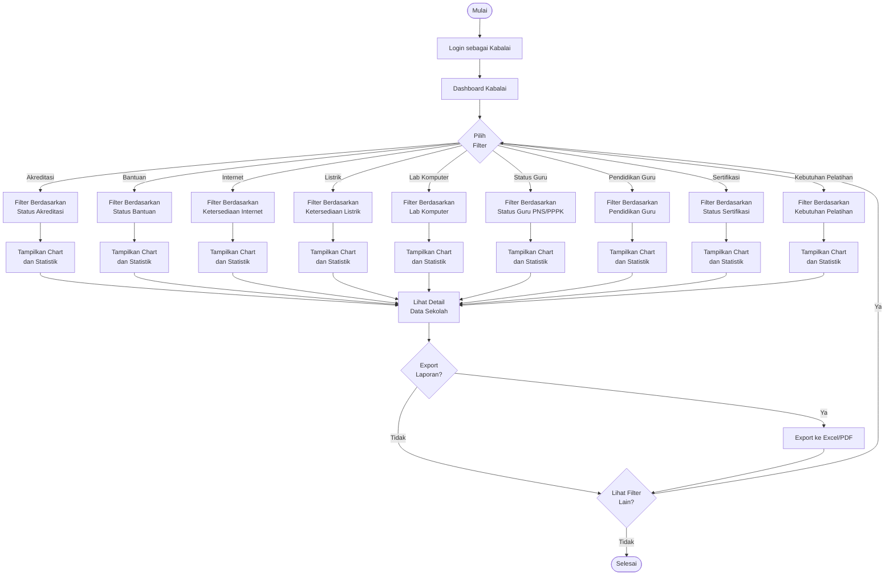

# Activity Diagram - Proses Monitoring (Kabalai)

## Alur Monitoring dan Filtering Data

## Penjelasan Alur

1. **Login Kabalai**: Kepala Balai masuk ke sistem
2. **Pilih Filter**: Memilih kriteria filter yang diinginkan
3. **Tampilkan Chart**: Sistem menampilkan visualisasi data
4. **Lihat Detail**: Melihat detail data per kategori
5. **Export**: Optional export laporan ke Excel/PDF
6. **Iterasi**: Dapat melihat filter lain atau selesai

## Jenis Filter yang Tersedia

### Filter Sekolah
- Status Akreditasi (A, B, C, Belum Terakreditasi)
- Status Bantuan (Sudah/Belum Menerima)
- Ketersediaan Internet (Ada/Tidak Ada)
- Ketersediaan Listrik (Ada/Tidak Ada)
- Laboratorium Komputer (Ada/Tidak Ada)

### Filter Guru
- Status Kepegawaian (PNS/PPPK)
- Pendidikan Terakhir (S1/S2/S3)
- Status Sertifikasi (Sudah/Belum)
- Kebutuhan Pelatihan

## Test Online

Copy code di atas dan paste ke: https://mermaid.live
