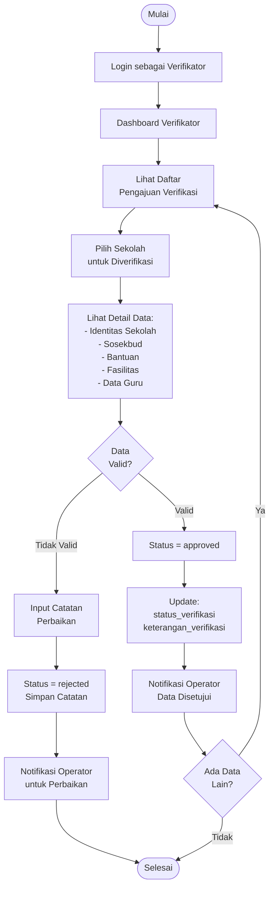

# Activity Diagram - Proses Verifikasi Data

## Alur Verifikasi oleh Verifikator

## Penjelasan Alur

1. **Login Verifikator**: Verifikator masuk ke sistem
2. **Lihat Daftar**: Melihat sekolah yang mengajukan verifikasi (status = pending)
3. **Review Data**: Memeriksa kelengkapan dan kebenaran data
4. **Keputusan**:
   - **Approved**: Data valid, status diubah menjadi approved
   - **Rejected**: Data tidak valid, dikembalikan dengan catatan perbaikan
5. **Notifikasi**: Operator mendapat notifikasi hasil verifikasi

## Status Verifikasi

- `pending`: Menunggu verifikasi
- `approved`: Data disetujui
- `rejected`: Data ditolak, perlu perbaikan

## Test Online

Copy code di atas dan paste ke: https://mermaid.live
