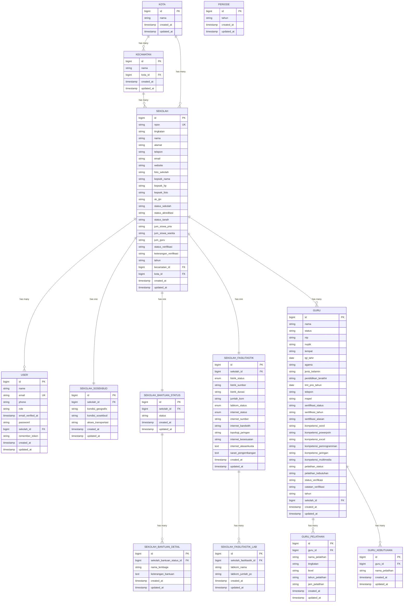

# Entity Relationship Diagram (ERD)

## Sistem Informasi Manajemen Data Sekolah dan Guru

## Keterangan Relasi

- `||--o{` : One-to-Many (Satu ke Banyak)
- `||--||` : One-to-One (Satu ke Satu)
- `PK` : Primary Key
- `FK` : Foreign Key
- `UK` : Unique Key

## Test Online

Copy code di atas dan paste ke: https://mermaid.live
