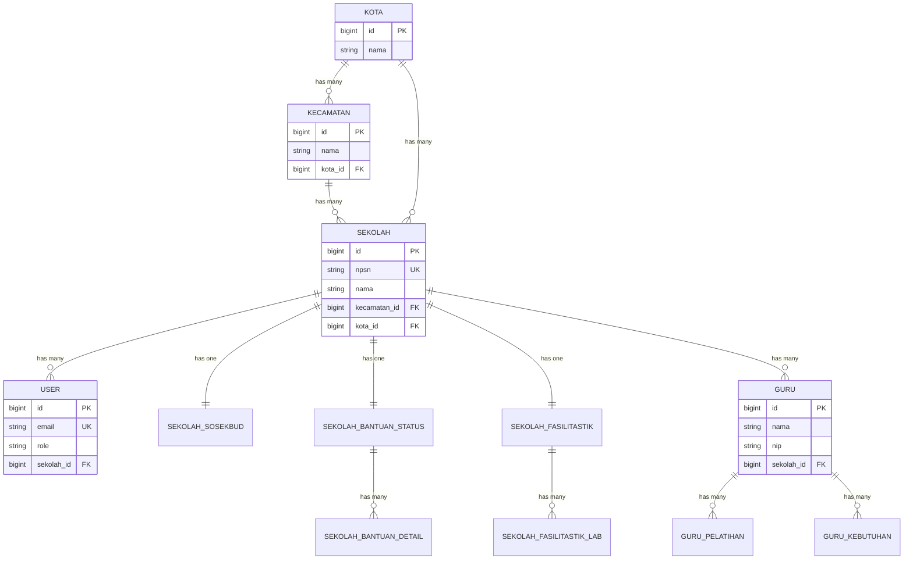
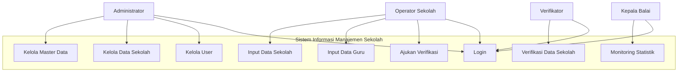
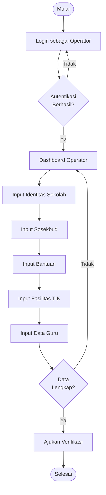
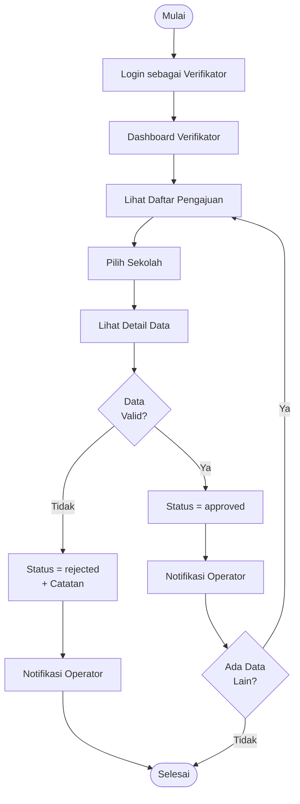
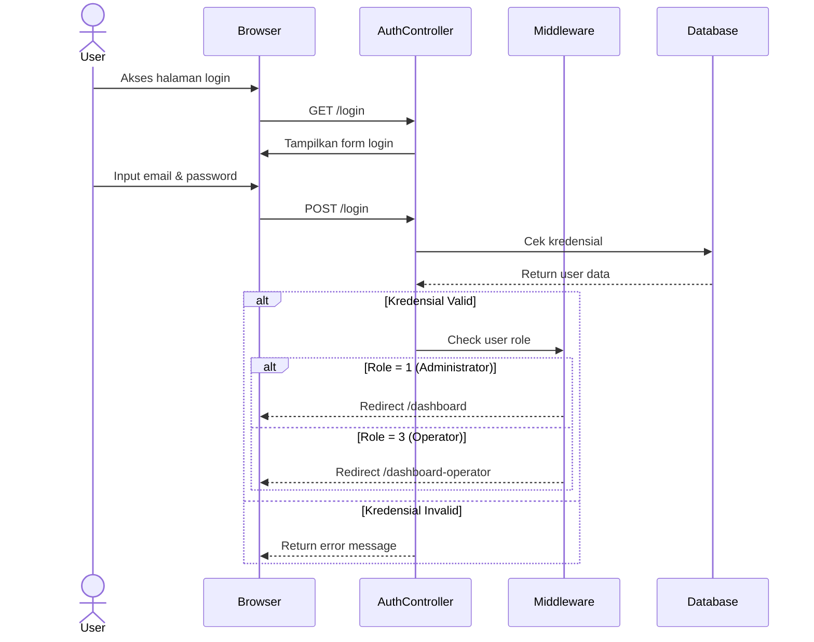
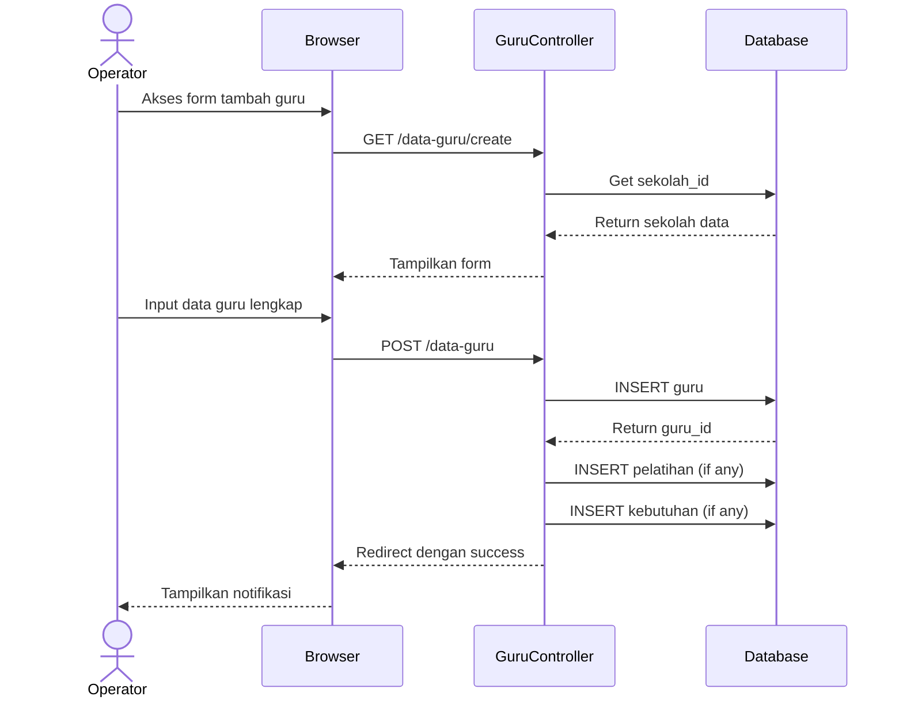

# 🧪 Preview Test - All Diagrams

File ini berisi semua diagram dalam satu halaman untuk testing cepat.

---

## 1️⃣ ERD - Entity Relationship Diagram

✅ **Status**: ERD dengan 15 tabel dan relasi

---

## 2️⃣ Use Case Diagram

✅ **Status**: Use Case dengan 4 aktor

---

## 3️⃣ Activity Diagram - Input Data (Simplified)

✅ **Status**: Activity diagram input data

---

## 4️⃣ Activity Diagram - Verifikasi

✅ **Status**: Activity diagram verifikasi

---

## 5️⃣ Sequence Diagram - Login

✅ **Status**: Sequence diagram login

---

## 6️⃣ Sequence Diagram - Input Guru (Simplified)

✅ **Status**: Sequence diagram input guru

---

## 🎯 Testing Instructions

### Di VS Code:
1. Buka file ini
2. Tekan `Ctrl+Shift+V` untuk preview
3. Scroll untuk melihat semua diagram
4. Pastikan semua diagram render dengan benar

### Checklist:
- [ ] ERD terlihat dengan jelas
- [ ] Use Case diagram terlihat
- [ ] Activity diagram input data terlihat
- [ ] Activity diagram verifikasi terlihat
- [ ] Sequence diagram login terlihat
- [ ] Sequence diagram input guru terlihat
- [ ] Tidak ada error rendering
- [ ] Semua teks terbaca dengan jelas

### Jika Ada Masalah:
1. Pastikan extension Mermaid sudah terinstall
2. Reload VS Code
3. Cek syntax di https://mermaid.live
4. Update extension ke versi terbaru

---

## 📊 Diagram Statistics

| Type | Count | Status |
|------|-------|--------|
| ERD | 1 | ✅ Working |
| Use Case | 1 | ✅ Working |
| Activity | 2 | ✅ Working |
| Sequence | 2 | ✅ Working |
| **Total** | **6** | **All Working** |

---

**Note**: Ini adalah versi simplified untuk testing cepat. Untuk diagram lengkap, lihat file individual di folder ini.
