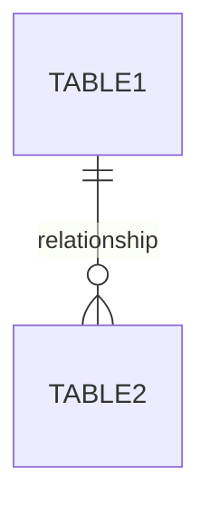
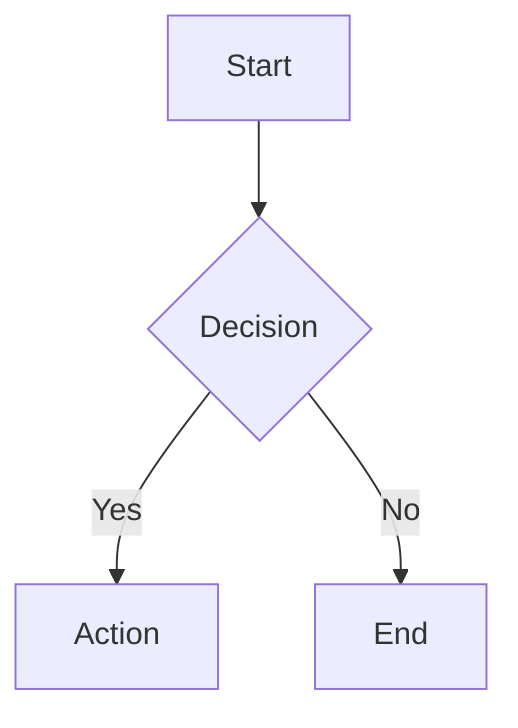
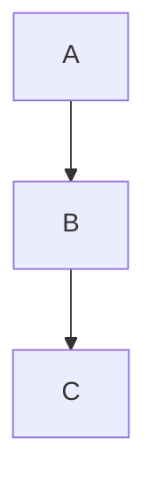

# Mermaid Diagrams Collection

## Sistem Informasi Manajemen Data Sekolah dan Guru

Folder ini berisi semua diagram Mermaid untuk dokumentasi sistem dalam file terpisah.

## Daftar Diagram

### 1. Entity Relationship Diagram (ERD)
📄 File: `ERD.md`

Diagram relasi antar tabel database dengan 15 tabel utama:
- Master data (Kota, Kecamatan, Periode)
- Data sekolah dan pendukung
- Data guru dan pelatihan
- Data user

### 2. Use Case Diagram
📄 File: `UseCase-Diagram.md`

Diagram use case dengan 4 aktor dan 15 use case:
- Administrator
- Operator Sekolah
- Verifikator
- Kepala Balai (Kabalai)

### 3. Activity Diagrams

#### 3.1 Input Data Sekolah
📄 File: `Activity-Diagram-Input-Data.md`

Alur lengkap input data oleh operator sekolah dari login hingga ajukan verifikasi.

#### 3.2 Verifikasi Data
📄 File: `Activity-Diagram-Verifikasi.md`

Alur proses verifikasi data oleh verifikator dengan approve/reject workflow.

#### 3.3 Monitoring Data
📄 File: `Activity-Diagram-Monitoring.md`

Alur monitoring dan filtering data oleh Kabalai dengan 9 jenis filter.

### 4. Sequence Diagrams

#### 4.1 Login dan Autentikasi
📄 File: `Sequence-Diagram-Login.md`

Sequence diagram proses login dengan role-based redirect.

#### 4.2 Input Data Guru
📄 File: `Sequence-Diagram-Input-Guru.md`

Sequence diagram input data guru dengan relasi pelatihan dan kebutuhan.

#### 4.3 Verifikasi Data Sekolah
📄 File: `Sequence-Diagram-Verifikasi.md`

Sequence diagram proses verifikasi dengan notifikasi.

#### 4.4 Filter dan Monitoring
📄 File: `Sequence-Diagram-Monitoring.md`

Sequence diagram filtering data dan export laporan.

## Cara Menggunakan

### 1. View Online
Copy code dari file `.md` dan paste ke:
- **Mermaid Live Editor**: https://mermaid.live
- **GitHub**: Langsung render di markdown
- **GitLab**: Langsung render di markdown

### 2. VS Code
Install extension:
- **Markdown Preview Mermaid Support**
- **Mermaid Markdown Syntax Highlighting**

### 3. Export ke Gambar
Di Mermaid Live Editor:
1. Paste code
2. Klik "Actions"
3. Pilih format: PNG, SVG, atau PDF
4. Download

### 4. Embed di Dokumentasi
```markdown
# Judul

## Diagram

\`\`\`mermaid
[paste mermaid code here]
\`\`\`
```

## Sintaks Mermaid

### ERD


### Flowchart


### Sequence
```mermaid
sequenceDiagram
    Actor->>System: Request
    System-->>Actor: Response
```

### Graph


## Relationship Symbols

| Symbol | Meaning |
|--------|---------|
| `\|\|--o{` | One-to-Many |
| `\|\|--\|\|` | One-to-One |
| `}o--o{` | Many-to-Many |
| `-->` | Arrow |
| `-.->` | Dotted arrow |

## Tips

1. **Gunakan label yang jelas** untuk relasi
2. **Konsisten dengan naming** (UPPERCASE untuk tabel)
3. **Tambahkan keterangan** di bawah diagram
4. **Test di Mermaid Live** sebelum commit
5. **Export ke PNG** untuk presentasi

## Resources

- **Mermaid Documentation**: https://mermaid.js.org/
- **Mermaid Live Editor**: https://mermaid.live
- **Mermaid Cheat Sheet**: https://jojozhuang.github.io/tutorial/mermaid-cheat-sheet/

## Update Log

- **2026-02-15**: Initial creation - All diagrams created
- Semua diagram telah ditest dan berfungsi dengan baik

## License

MIT License - Free to use and modify

---

**Catatan**: Semua diagram ini adalah bagian dari dokumentasi sistem dan dapat diupdate sesuai kebutuhan pengembangan.
