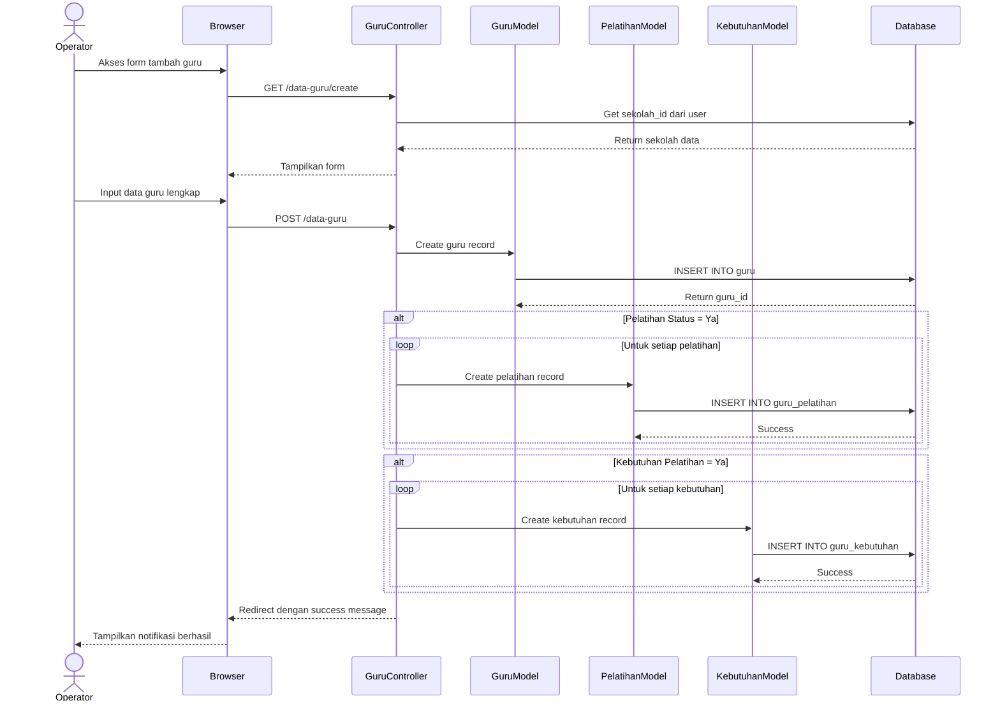

# Sequence Diagram - Input Data Guru

## Alur Input Data Guru dengan Relasi



## Penjelasan Alur

1. **Load Form**: Operator membuka form tambah guru
2. **Get Sekolah**: System ambil data sekolah dari user yang login
3. **Input Data**: Operator mengisi data guru lengkap
4. **Save Guru**: Data guru utama disimpan ke tabel `guru`
5. **Save Pelatihan**: Jika ada riwayat pelatihan, simpan ke `guru_pelatihan`
6. **Save Kebutuhan**: Jika ada kebutuhan pelatihan, simpan ke `guru_kebutuhan`
7. **Success**: Redirect dengan notifikasi berhasil

## Data yang Diinput

### Data Identitas
- Nama, NIP, NUPTK
- Tempat tanggal lahir
- Status kepegawaian (PNS/PPPK)
- Pendidikan terakhir

### Data Kompetensi
- Mata pelajaran
- Status sertifikasi
- Kompetensi TIK (Word, Excel, PowerPoint, Programming, Jaringan, Multimedia)

### Riwayat Pelatihan (Multiple)
- Nama pelatihan
- Tingkatan (Pemula/Lanjutan/Mahir)
- Level (Lokal/Nasional/Internasional)
- Tahun dan jam pelatihan

### Kebutuhan Pelatihan (Multiple)
- Nama pelatihan yang dibutuhkan

## Relasi Database

```
guru (1) --> (N) guru_pelatihan
guru (1) --> (N) guru_kebutuhan
sekolah (1) --> (N) guru
```

## Test Online

Copy code di atas dan paste ke: https://mermaid.live
