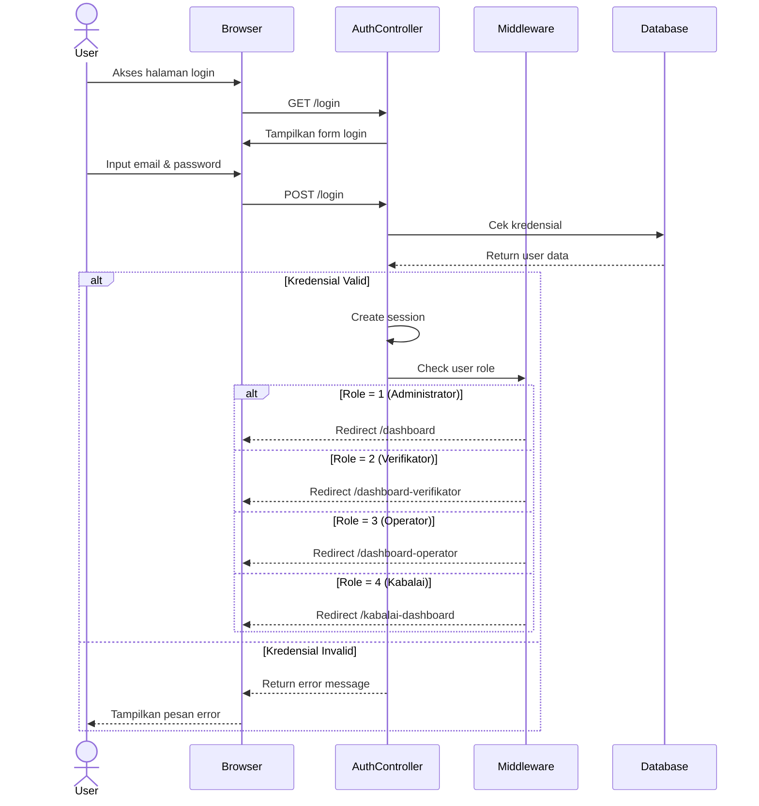

# Sequence Diagram - Login dan Autentikasi

## Alur Login dengan Role-Based Redirect

## Penjelasan Alur

1. **Request Login Page**: User mengakses halaman login
2. **Submit Credentials**: User input email dan password
3. **Validasi**: System cek kredensial di database
4. **Create Session**: Jika valid, buat session untuk user
5. **Role Check**: Middleware memeriksa role user
6. **Redirect**: Redirect ke dashboard sesuai role

## Role dan Dashboard

| Role | Kode | Dashboard URL |
|------|------|---------------|
| Administrator | 1 | /dashboard |
| Verifikator | 2 | /dashboard-verifikator |
| Operator Sekolah | 3 | /dashboard-operator |
| Kepala Balai | 4 | /kabalai-dashboard |

## Kredensial Default Operator

- **Email**: NPSN sekolah
- **Password**: NPSN sekolah
- **Role**: 3 (Operator Sekolah)

## Test Online

Copy code di atas dan paste ke: https://mermaid.live
