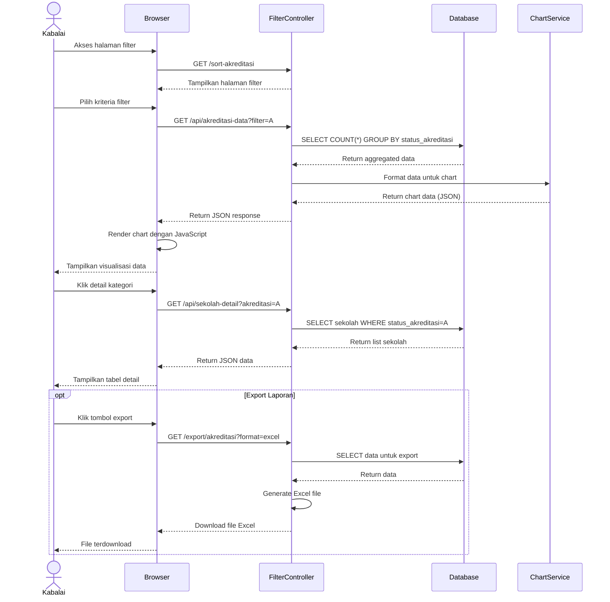

# Sequence Diagram - Filter dan Monitoring (Kabalai)

## Alur Filtering dan Export Data



## Penjelasan Alur

1. **Load Filter Page**: Kabalai membuka halaman filter
2. **Select Criteria**: Memilih kriteria filter (contoh: Akreditasi A)
3. **Fetch Aggregated Data**: System query data agregat dari database
4. **Format for Chart**: Data diformat untuk visualisasi chart
5. **Render Chart**: Browser render chart menggunakan JavaScript
6. **View Details**: Klik kategori untuk melihat detail data
7. **Export (Optional)**: Export data ke Excel/PDF

## API Endpoints untuk Monitoring

### Filter Sekolah
| Endpoint | Deskripsi |
|----------|-----------|
| GET /sort-akreditasi | Filter berdasarkan akreditasi |
| GET /api/akreditasi-data | Data chart akreditasi |
| GET /status-bantuan | Filter status bantuan |
| GET /sort/internet | Filter ketersediaan internet |
| GET /sort/listrik | Filter ketersediaan listrik |
| GET /status-labkomputer | Filter lab komputer |

### Filter Guru
| Endpoint | Deskripsi |
|----------|-----------|
| GET /sort-gurustatus | Filter status guru (PNS/PPPK) |
| GET /sort-gurupendidikan | Filter pendidikan guru |
| GET /sort-gurusertifikasi | Filter sertifikasi guru |
| GET /sort-gurupelatihan | Filter kebutuhan pelatihan |

## Response Format (JSON)

### Chart Data
```json
{
  "labels": ["A", "B", "C", "Belum Terakreditasi"],
  "data": [45, 32, 18, 5],
  "total": 100
}
```

### Detail Data
```json
{
  "data": [
    {
      "id": 1,
      "npsn": "12345678",
      "nama": "SMA Negeri 1",
      "status_akreditasi": "A",
      "kota": "Jakarta",
      "kecamatan": "Menteng"
    }
  ],
  "total": 45
}
```

## Visualisasi yang Tersedia

- Bar Chart (untuk perbandingan kategori)
- Pie Chart (untuk distribusi persentase)
- Line Chart (untuk trend data)
- Table (untuk detail data)

## Test Online

Copy code di atas dan paste ke: https://mermaid.live
