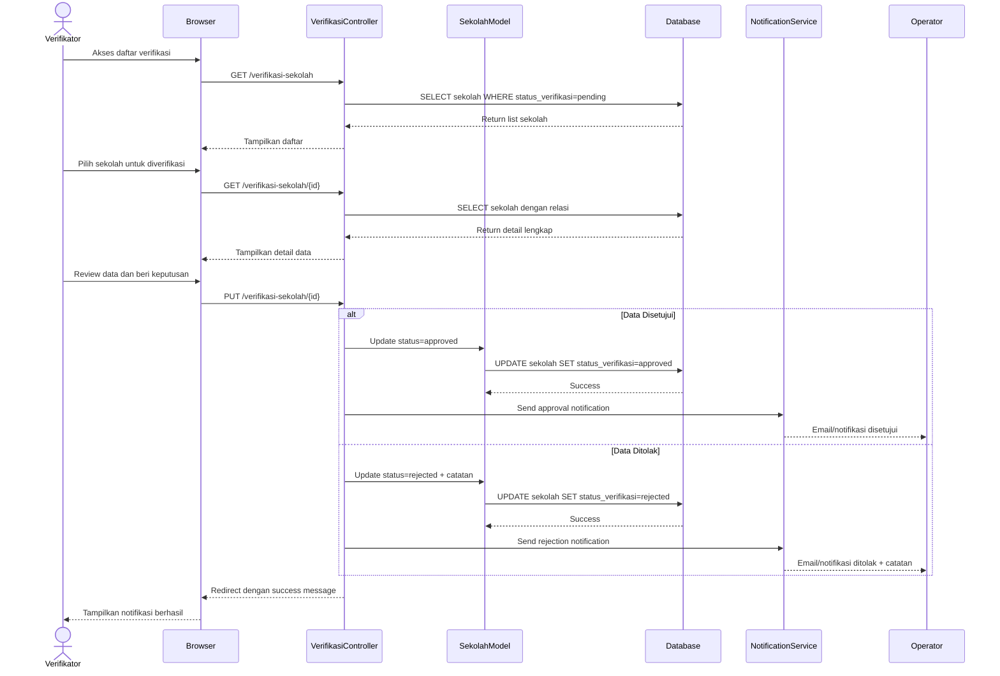

# Sequence Diagram - Verifikasi Data Sekolah

## Alur Verifikasi dengan Approve/Reject

## Penjelasan Alur

1. **List Pending**: Verifikator melihat daftar sekolah dengan status pending
2. **Select School**: Memilih sekolah yang akan diverifikasi
3. **Load Details**: System load data lengkap dengan semua relasi:
   - Identitas sekolah
   - Data sosekbud
   - Riwayat bantuan
   - Fasilitas TIK
   - Data guru
4. **Review**: Verifikator memeriksa kelengkapan dan kebenaran data
5. **Decision**:
   - **Approve**: Status = approved, data valid
   - **Reject**: Status = rejected, dengan catatan perbaikan
6. **Notification**: Operator mendapat notifikasi hasil verifikasi

## Status Verifikasi

| Status | Deskripsi |
|--------|-----------|
| `pending` | Menunggu verifikasi |
| `approved` | Data disetujui, valid untuk laporan |
| `rejected` | Data ditolak, perlu perbaikan |

## Data yang Diverifikasi

### Data Sekolah
- Identitas lengkap (NPSN, nama, alamat, kontak)
- Kepala sekolah (nama, HP, foto)
- Status akreditasi
- Jumlah siswa dan guru

### Data Pendukung
- Kondisi sosial ekonomi budaya
- Riwayat bantuan yang diterima
- Fasilitas TIK (listrik, komputer, internet, lab)

### Data Guru
- Identitas dan status kepegawaian
- Kompetensi TIK
- Riwayat pelatihan
- Kebutuhan pelatihan

## Test Online

Copy code di atas dan paste ke: https://mermaid.live
