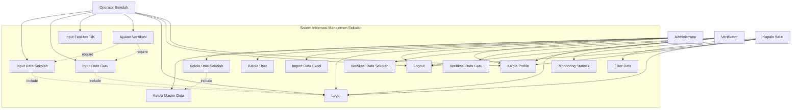

# Use Case Diagram

## Sistem Informasi Manajemen Data Sekolah dan Guru

## Deskripsi Use Case

| Use Case | Actor | Deskripsi |
|----------|-------|-----------|
| UC1 - Kelola Master Data | Administrator | Mengelola data kota, kecamatan, dan periode |
| UC2 - Kelola Data Sekolah | Administrator | CRUD data sekolah |
| UC3 - Kelola User | Administrator | Mengelola user verifikator dan kabalai |
| UC4 - Input Data Sekolah | Operator | Input identitas, sosekbud, bantuan sekolah |
| UC5 - Input Data Guru | Operator | Input data guru, kompetensi, pelatihan |
| UC6 - Input Fasilitas TIK | Operator | Input data listrik, komputer, internet, lab |
| UC7 - Ajukan Verifikasi | Operator | Mengajukan data untuk diverifikasi |
| UC8 - Verifikasi Data Sekolah | Verifikator | Memeriksa dan approve/reject data sekolah |
| UC9 - Verifikasi Data Guru | Verifikator | Memeriksa dan approve/reject data guru |
| UC10 - Monitoring Statistik | Kabalai | Melihat dashboard dan statistik |
| UC11 - Filter Data | Kabalai | Filter data berdasarkan berbagai kriteria |
| UC12 - Login | Semua | Autentikasi pengguna |
| UC13 - Logout | Semua | Keluar dari sistem |
| UC14 - Kelola Profile | Semua | Update profile dan password |
| UC15 - Import Data Excel | Administrator | Import bulk data sekolah dari Excel |

## Test Online

Copy code di atas dan paste ke: https://mermaid.live
